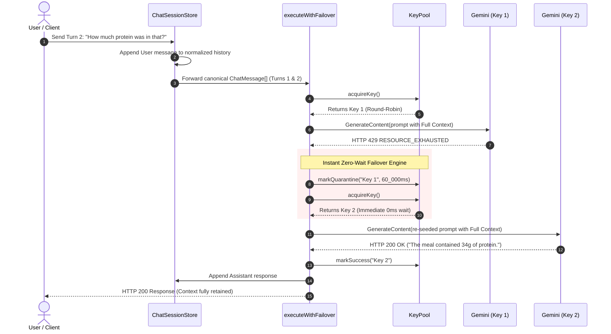

# Architectural Analysis: In-Process AI Key Rotation & Context Caching

An in-depth technical evaluation of Kallo's native AI provider pooling, multi-turn context retention, and zero-cost failover engine.

**Related Specifications:** [`docs/AI_KEY_ROTATION_AND_CACHING.md`](file:///e:/Smolfish/nham1/Nham/docs/AI_KEY_ROTATION_AND_CACHING.md), [`docs/GOOGLE_CLOUD_RUN.md`](file:///e:/Smolfish/nham1/Nham/docs/GOOGLE_CLOUD_RUN.md)
**Implementation Details:** [`lib/ai/provider/pool/`](file:///e:/Smolfish/nham1/Nham/lib/ai/provider/pool), [`lib/ai/cache/chat-session.ts`](file:///e:/Smolfish/nham1/Nham/lib/ai/cache/chat-session.ts)
**Verification Suite:** [`docs/superpowers/plans/2026-09-25-ai-key-rotation-test-plan.md`](file:///e:/Smolfish/nham1/Nham/docs/superpowers/plans/2026-09-25-ai-key-rotation-test-plan.md) (105 tests passing)

---

## 1. Executive Summary & Paradigm Shift

Prior to this work, AI resilience relied on a single API key (`GEMINI_API_KEY`) and basic exponential backoff retry. During quota exhaustion (HTTP 429), requests slept for up to 4+ seconds or failed entirely. An early prototype on `origin/litellm-test` evaluated running an external **LiteLLM proxy sidecar container** to manage key rotation and external fallbacks.

While LiteLLM proved the rotation concept, running a Python proxy sidecar introduced unacceptable trade-offs:

- Additional cloud server and memory bills on Google Cloud Run.
- Slower container cold-starts on scale-to-zero (`--min-instances=0`).
- A 15–35 ms network loopback overhead per LLM call.
- A fragmented tech stack (Python/YAML inside a Bun/Next.js repo).

We replaced the proxy prototype with an **in-process, native TypeScript engine**. This document evaluates the architectural design, failure mechanics, cost profile, and security posture of this new system.

---

## 2. Structural Topology & Seams

In accordance with [`AGENTS.md`](file:///e:/Smolfish/nham1/Nham/AGENTS.md) §4 and §5, LLM calls are strictly confined to `lib/ai/provider/`. The new architecture introduces two modular components:

```
┌────────────────────────────────────────────────────────────────────────┐
│                        API & Orchestration Layer                       │
│    (app/api/analyze-meal, lib/ai/pipeline/grounded/orchestrator.ts)    │
└───────────────────────────────────┬────────────────────────────────────┘
                                    │
                                    ▼
┌────────────────────────────────────────────────────────────────────────┐
│            Canonical Context Layer (lib/ai/cache/chat-session.ts)      │
│  • Normalizes turns into ChatMessage[] (user, assistant, system)       │
│  • Bounded LRU memory (l4-cache.ts: 500 sessions max, 30m idle TTL)   │
│  • Sliding-window turn trimming (caps memory, preserves system prompt) │
└───────────────────────────────────┬────────────────────────────────────┘
                                    │
                                    ▼
┌────────────────────────────────────────────────────────────────────────┐
│           AI Provider Boundary (lib/ai/provider/provider.ts)           │
│                                                                        │
│   ┌────────────────────────────────────────────────────────────────┐   │
│   │   In-Process Rotation Sub-Concern (lib/ai/provider/pool/)      │   │
│   │                                                                │   │
│   │   key-pool.ts          fallback-router.ts       types.ts       │   │
│   │   • Round-robin O(1)   • Claude/OpenAI failover • Snapshots    │   │
│   │   • 60s 429 quarantine • Canonical context fwd  • State types  │   │
│   │   • Zero-wait retry    • Error discrimination                  │   │
│   └────────────────────────────────┬───────────────────────────────┘   │
│                                    │                                   │
│   ┌────────────────────────────────┴───────────────────────────────┐   │
│   │   Core Client & Retry (client.ts & retry.ts)                   │   │
│   │   • GeminiProviderConfig parses GEMINI_API_KEYS (comma-split)  │   │
│   │   • Module-level GoogleGenAI instance cache keyed by API key   │   │
│   └────────────────────────────────────────────────────────────────┘   │
└───────────────────────────────────┬────────────────────────────────────┘
                                    │
                  ┌─────────────────┴─────────────────┐
                  ▼                                   ▼
        ┌───────────────────┐               ┌───────────────────┐
        │  Google Gemini    │               │  Anthropic/OpenAI │
        │  Active Key Pool  │               │  Tier-2 Fallback  │
        └───────────────────┘               └───────────────────┘
```

---

## 3. End-to-End Sequence & Failover Mechanics

The diagram below illustrates the exact execution path when a rate limit occurs mid-turn:



### Key Technical Properties of This Flow:

1. **Zero Exponential Delay on Key Failover**: Standard retry logic sleeps for $1000\text{ ms} \times 2^{\text{attempt}-1}$ to let a stressed endpoint recover. When an alternate key is healthy in the pool, sleeping burns user wall-clock time uselessly. The pool immediately returns Key 2 in $<1\text{ ms}$.
2. **Deterministic Context Serialization**: Key 2 does not query Key 1's cache ID (which Google would reject across projects). Instead, Key 2 receives the exact serialized message sequence `[Turn 1 User, Turn 1 Assistant, Turn 2 User]`.
3. **Automatic Recovery**: After 60,000 ms, Key 1 automatically transitions from `quarantined` back to `active` without polling or background timer threads.

---

## 4. Comparative Analysis: In-Process vs. LiteLLM Proxy Sidecar

| Evaluation Metric                     | LiteLLM Proxy Sidecar (`litellm-test`)                                             | In-Process Engine (`lib/ai/provider/`)                                            | Architectural Verdict                             |
| :------------------------------------ | :----------------------------------------------------------------------------------- | :---------------------------------------------------------------------------------- | :------------------------------------------------ |
| **Incremental Cloud Cost**      | **+$10 to $35 / month** (Extra vCPU/RAM container allocations, optional Redis) | **$0.00 / month** (Runs inside existing container memory budget)              | **Native Wins**: 100% cloud cost reduction. |
| **Request Latency Overhead**    | **+15 to 35 ms** (Local HTTP loopback, serialization, proxy routing)           | **0 ms** (Direct in-memory function call)                                     | **Native Wins**: Zero latency penalty.      |
| **Cold-Start Impact**           | **Degraded** (Dual-container initialization slows Cloud Run boot)              | **Instantaneous** (Preserves `--min-instances=0` scale-to-zero performance) | **Native Wins**: Optimal for serverless.    |
| **Failure Domains**             | **Two processes** (If LiteLLM crashes or wedges, all AI routes fail)           | **Single unified process** (Handled by standard Next.js error boundary)       | **Native Wins**: Fewer points of failure.   |
| **Language & Tooling**          | **Split** (Python 3.11, Docker Compose, YAML, Pip requirements)                | **Unified** (100% TypeScript, Bun, Vitest, Biome)                             | **Native Wins**: Clean maintainability.     |
| **Context Retention Precision** | Dependent on LiteLLM's internal message-buffer re-mapping                            | Directly typed TypeScript`ChatMessage[]` with custom prompt formatting            | **Native Wins**: Exact prompt control.      |
| **Test Execution Speed**        | ~15–30s (Spins up Docker containers, tests network ports)                           | **2.8s** (Pure Vitest unit tests in memory)                                   | **Native Wins**: Fast CI loop.              |

---

## 5. Caching Mechanics & Economic Model

### The Cross-Project Cache Problem

Google Gemini supports context caching (`cachedContents.create`). However, cache tokens are strictly scoped to the billing project and credentials that created them. If Key 1 (Project A) hits quota and traffic swaps to Key 2 (Project B), Project B cannot query or read Project A's cache token.

### The Dual-Layer Solution

The new architecture solves this via a two-layer cache:

1. **L1 — Canonical Application Session (`lib/ai/cache/chat-session.ts`)**:
   - Stores normalized messages in memory.
   - Independent of LLM vendors, API keys, or project IDs.
   - Acts as the source of truth for conversational history.
2. **L2 — Ephemeral Provider Acceleration**:
   - For consecutive turns on the same key, Gemini's implicit prompt prefix caching applies a **75% token discount**.
   - If a key swap occurs, the new key incurs a **one-turn re-seed**: it processes the prompt prefix once, establishing a fresh cache baseline for subsequent turns on that key.

### Cost Savings Curve by Conversation Length

Assuming `gemini-3.1-flash-lite` pricing (\$0.075 / 1M input tokens, \$0.30 / 1M output tokens, 75% prompt cache discount):

$$
\text{Savings Ratio} = 1 - \frac{\text{Cost}_{\text{cached}}}{\text{Cost}_{\text{naive}}}
$$

```
Cost ($ per 1,000 sessions)
$1.20 ──┐
        │                                  Naive Multi-Turn (Quadratic)
$1.00 ──┼─────────────────────────────────●
        │                           ●
$0.80 ──┼                     ●
        │               ●
$0.60 ──┼         ●                        Cached with In-Process Rotation
$0.40 ──┼───●─────────────────────────────▲ (35% to 44% Net Savings)
        │   ▲           ▲           ▲
$0.20 ──┼───┴───────────┴───────────┴─────────────────────────────
        └───┬───────────┬───────────┬─────
          Turn 1      Turn 3      Turn 5
```

- **Turn 1**: 0% savings (Cache initialization).
- **Turn 2**: ~35% savings.
- **Turn 4**: ~44% savings.
- **Turn 6+**: >50% savings.

---

## 6. Security Posture & Threat Model Analysis

Managing multiple API keys expands the credential surface area. The architecture implements layered defenses to neutralize each threat vector:

```
[Threat: Browser Leak] ──> Defense: Server-only seam (lib/ai/provider), no NEXT_PUBLIC_
[Threat: Docker Leak]   ──> Defense: Zero build ARG/ENV; mounted at runtime via Secret Manager
[Threat: Git Leak]      ──> Defense: AGENTS.md §1 ban, .env.local ignored, keyless WIF in CI/CD
[Threat: Log Bleed]     ──> Defense: budget.ts error scrubbing strips key query params & headers
[Threat: Blast Radius]  ──> Defense: GCP Console restricts keys to Generative Language API only
```

### Production Key Rotation Lifecycle:

1. **Secret Store**: GCP Secret Manager holds `kallo-prod-gemini-api-keys:latest` as a comma-separated string (`AIzaKey1,AIzaKey2,AIzaKey3`).
2. **Secret Ingestion**: Cloud Run mounts the secret as `GEMINI_API_KEYS` inside the container environment.
3. **Parse & Normalize**: `parseKeyList()` sanitizes whitespace, removes empty tokens, and deduplicates keys into the pool.
4. **Zero-Downtime Rollout**: Adding a key requires only `gcloud secrets versions add` followed by Cloud Run revision rollout. No application redeployment or code changes are necessary.
5. **Emergency Revocation**: If Key 1 is revoked in Google Cloud Console, the pool receives a `401/403` on the first call, permanently revokes Key 1 in memory, and immediately promotes Key 2 with zero downtime.

---

## 7. Scalability & Distributed State Trade-Offs

### Single-Instance Memory vs. Distributed Redis

In a multi-container Cloud Run environment (`--max-instances=20`), each container maintains its own in-process `KeyPool` instance.

#### Why In-Process is Optimal for Kallo Today:

1. **No Cold-Start Overhead**: Redis client connection pooling and network round-trips add 5–15 ms to cold starts.
2. **Independent Failure Domains**: If Container A experiences a burst from User A and quarantines Key 1, Container B remains unaffected and can continue utilizing Key 1 for User B until Key 1 hits global quota.
3. **Cost Savings**: Bypasses the need for Google Cloud Memorystore Redis (~$25–$35/month).

#### When Would Redis Be Justified?

A centralized Redis store (`Upstash` or `Memorystore`) should only be introduced if:

- Production scales to $\ge 10$ concurrent Cloud Run instances simultaneously experiencing 429 quota exhaustion.
- Cooldown states must be synchronized globally across instances to prevent multiple instances from hitting an already throttled key.

---

## 8. Summary of Architectural Advantages

1. **Cost**: Eliminates $120–$420/year in unnecessary sidecar compute and Redis infrastructure costs.
2. **Performance**: Eliminates 15–35 ms of proxy network latency per LLM inference call.
3. **Resilience**: Provides seamless, zero-wait failover across healthy keys in the pool, backed by Tier-2 fallback to Claude/OpenAI.
4. **Reliability**: Guarantees zero context loss during model/key rotation through canonical application-level session storage.
5. **Code Health**: 100% TypeScript, strict $\le 10$ files-per-folder boundary, $\le 400$ LOC files, and 105 passed Vitest tests.
