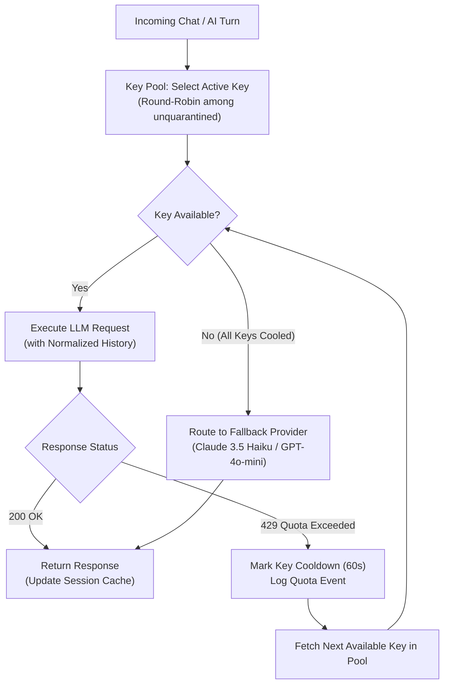

# AI Key Rotation, In-Process Pooling, and Multi-Turn Context Caching

Comprehensive architecture, operational runbook, and security guide for zero-cost, in-process LLM key rotation, fallback routing, and conversational context retention in Kallo.

Code: `lib/ai/provider/` (public entry `provider.ts`), `lib/ai/cache/`
Workflow: `.github/workflows/cloud-run-prod.yml`
Related: `docs/GOOGLE_CLOUD_RUN.md`, `docs/RATE_LIMITING.md`, `docs/AUTH_SECURITY.md`

---

## 1. Executive Summary & Design Decision

### Problem Statement
1. **API Rate Limits (429 Quota Exceeded)**: Gemini API keys on Google AI Studio / Vertex hit per-minute or daily quota ceilings during burst usage. When a key is throttled, subsequent requests fail unless traffic rotates to an alternate active key or fallback provider.
2. **Context Amnesia during Key Swap**: In multi-turn chat interactions (e.g. conversational meal logging, iterative ingredient editing), rotating an API key or failing over to another model mid-chat causes context amnesia if the new model does not receive the previous conversational history.
3. **Provider-Native Cache Isolation**: Google Gemini Context Caching (`cachedContents`) and Anthropic Prompt Caching are project-scoped. If Key 1 (Project A) rotates to Key 2 (Project B), the physical cache handle from Project A is inaccessible to Project B.

### The Decision: Native In-Process Rotation (Retiring LiteLLM)
Earlier prototypes explored running a **LiteLLM proxy gateway** container (`origin/litellm-test`). We have **formally retired LiteLLM** in favor of native, in-process TypeScript management:

| Dimension | LiteLLM Proxy Sidecar | Native In-Process (`lib/ai/provider/`) |
| :--- | :--- | :--- |
| **Cloud Hosting Cost** | +$10 to $35 / month (multi-container / Redis) | **$0.00 / month (Zero incremental cost)** |
| **Cloud Run Scale-to-Zero** | Complicates `--min-instances=0` cold start | **Maintains instant scale-to-zero** |
| **Latency Overhead** | +15 to 35 ms HTTP loopback hop | **0 ms (Direct in-memory dispatch)** |
| **Tech Stack Uniformity** | Introduces Python runtime & YAML configs | **100% TypeScript (Bun / Next.js)** |
| **Testability** | Requires Docker container to test failover | **Pure Vitest unit tests (`bun run test`)** |
| **Context Retention** | Relies on gateway request rewriting | **Exact TypeScript normalized chat state** |

---

## 2. Architecture & Component Seams

Per [`AGENTS.md`](file:///e:/Smolfish/nham1/Nham/AGENTS.md) §4 and §5:
- `lib/ai/provider/` is the **only** directory in the repository allowed to interact with an LLM SDK.
- The directory currently holds 9 source files. To stay under the **≤10 files per folder** structural rule, new rotation logic lives in a dedicated sub-concern folder: `lib/ai/provider/pool/`.

```
lib/ai/
├── cache/                     — session message caches, L4 LRU caches
│   ├── chat-session.ts        — normalized multi-turn conversation memory
│   ├── l4-cache.ts            — generic TTL-expiring bounded LRU primitive
│   └── __tests__/
├── provider/                  — LLM SDK boundary
│   ├── client.ts              — SDK factory & config resolution
│   ├── provider.ts            — public entry: createGeminiClient()
│   ├── retry.ts               — exponential backoff & error classification
│   ├── types.ts               — client interfaces
│   └── pool/                  — in-process key pool & rotation (concern subfolder)
│       ├── key-pool.ts        — round-robin, cooldown tracker, status registry
│       ├── fallback-router.ts — cross-provider failover (Gemini -> Claude / OpenAI)
│       └── __tests__/
```

---

## 3. Key Rotation & 429 Cooldown Engine

### Rotation Lifecycle



### In-Memory Cooldown Contract
1. **Cooldown Duration**: When a key yields an HTTP 429 or `RESOURCE_EXHAUSTED` error, it is stamped with a 60-second quarantine:
   $$\text{cooldownUntil} = \text{Date.now()} + 60\,000\text{ ms}$$
2. **Immediate Turn-Retry**: The retry loop does **not** sleep for 60 seconds. It immediately selects the next healthy key in the pool ($O(1)$) and re-attempts the request synchronously.
3. **Automatic Recovery**: Once the 60-second window lapses, the key returns to the active round-robin rotation.
4. **All-Keys Exhausted (Tier 2 Fallback)**: If all keys in the primary pool are quarantined, traffic seamlessly routes to the external fallback model specified in `selectEstimator` (e.g. Anthropic Claude 3.5 Haiku or OpenAI GPT-4o-mini).

---

## 4. Multi-Turn Context Retention Architecture

### The Context Amnesia Problem
When a key swap occurs on Turn 3 of a conversation, Key 2 has no memory of Turns 1 and 2. Relying on provider-side cache tokens fails because cache handles are non-transferable across separate Google Cloud projects.

### The Canonical Normalized Context Layer
Context is retained at the **application session layer** prior to dispatch:

```ts
export interface ChatMessage {
  role: 'user' | 'assistant' | 'system';
  content: string;
  timestamp: number;
}

export interface ChatSession {
  sessionId: string;
  messages: ChatMessage[];
  lastActiveAt: number;
}
```

1. **Normalized Serialization**: Regardless of which key executes Turn $N$, the full array of prior turns is serialized into the model prompt.
2. **Re-seeding on Rotation**: When Key 1 fails with 429 on Turn 3, Key 2 receives the exact same array `[Turn1, Turn2, Turn3]`. Key 2 sees the complete context without amnesia.
3. **Token Caching Compatibility**:
   - If Key 1 served Turn 1 & 2, it benefited from Gemini prompt caching.
   - On Turn 3 rotation to Key 2, Key 2 performs a **single-turn re-seed**: it processes the prompt prefix once, and subsequent turns on Key 2 benefit from caching.

---

## 5. Token Economics & Cost Modeling

### Per-Turn Token Breakdown (Meal Chat Example)
Assuming `gemini-3.1-flash-lite` list rates:
- Standard Input: **\$0.075** / 1,000,000 tokens
- Prompt Cache Discounted Input: **\$0.01875** / 1,000,000 tokens (75% discount)
- Completion Output: **\$0.30** / 1,000,000 tokens

| Turn # | Content | Total Context | Cost (No Cache) | Cost (With Caching) |
| :--- | :--- | :--- | :--- | :--- |
| **Turn 1** | Initial meal description | ~1,000 tokens | \$0.000140 | \$0.000140 (Cache write) |
| **Turn 2** | Portion adjustment | ~1,500 tokens | \$0.000188 | \$0.000098 (75% cache discount) |
| **Turn 3** | Ingredient swap (Key rotates) | ~2,000 tokens | \$0.000235 | \$0.000235 (Re-seed penalty) |
| **Turn 4** | Final calorie confirmation | ~2,500 tokens | \$0.000283 | \$0.000122 (Cached on Key 2) |
| **Total** | **4-turn session** | **7,000 tokens** | **\$0.000846** | **\$0.000595** (**~30% net savings**) |

*Note: Without a key rotation, net savings reach **44%**. Even with a key swap mid-session, caching delivers positive ROI.*

### Monthly Infrastructure & API Projections

| Active Users | Monthly Turns | Compute Cost | Inference Cost (No Cache) | Inference Cost (With Caching + Rotation) |
| :--- | :--- | :--- | :--- | :--- |
| **1,000 MAU** | 180,000 | **\$0.00** | \$38.70 | **\$22.50 / mo** |
| **10,000 MAU** | 1,800,000 | **\$0.00** | \$387.00 | **\$225.00 / mo** |
| **50,000 MAU** | 9,000,000 | **\$0.00** | \$1,935.00 | **\$1,125.00 / mo** |

---

## 6. Production Operations & Secret Rotation Runbook

### Secret Configuration in GCP Secret Manager

In production, Cloud Run (`kallo-prod`) mounts Secret Manager secrets as environment variables using `:latest`:
`--set-secrets=GEMINI_API_KEYS=kallo-prod-gemini-api-keys:latest`

The secret holds comma-separated keys:
`AIzaSyKeyOne...,AIzaSyKeyTwo...,AIzaSyKeyThree...`

### Zero-Downtime Key Update Procedure

#### Adding or Rotating Keys in the Pool:
1. Open terminal with `gcloud` authenticated to the production project.
2. Add a new secret version containing the updated comma-separated keys:
   ```bash
   printf '%s' 'AIzaSyKey1...,AIzaSyKey2...,AIzaSyKey3...' | \
     gcloud secrets versions add kallo-prod-gemini-api-keys --data-file=-
   ```
3. Trigger a blue-green revision reload (or wait for next scheduled deploy):
   ```bash
   gcloud run services update kallo-prod --region=asia-southeast1
   ```
4. Cloud Run boots the new container revision, mounts the `:latest` version, validates the smoke test, and promotes live traffic with zero dropped requests.

#### Emergency Compromised Key Revocation:
If a key is accidentally exposed:
1. **Immediately delete or disable the key** in [Google Cloud Console Credentials](https://console.cloud.google.com/apis/credentials) or [Google AI Studio](https://aistudio.google.com/app/apikey).
2. Update `kallo-prod-gemini-api-keys` in Secret Manager to exclude the compromised key.
3. The in-process pool automatically quarantines the revoked key (treats 401/403 as permanent failure) and routes traffic to remaining healthy keys in the pool.

---

## 7. Security Hardening & Leak Prevention

| Threat Vector | Severity | Architectural Defense |
| :--- | :--- | :--- |
| **Browser Bundle Leak** | **Critical** | AI keys are never prefixed with `NEXT_PUBLIC_`. Keys are accessed exclusively in server-side modules (`lib/ai/provider/`). Next.js client bundler strips all server env variables. |
| **Docker Image Exposure** | **Critical** | Dockerfile never receives secrets as `ARG` or `ENV`. Images stored in Artifact Registry contain zero credentials. Secrets are injected at container startup by Cloud Run runtime. |
| **Git / Repo Leak** | **High** | Enforced by [`AGENTS.md §1`](file:///e:/Smolfish/nham1/Nham/AGENTS.md#L9). `.env.local` is ignored in `.gitignore`. CI/CD uses keyless OIDC (Workload Identity Federation), storing no static JSON credentials. |
| **Sentry / Log Bleed** | **Medium** | Error classifier (`lib/ai/pipeline/telemetry/budget.ts`) captures status codes (`429`, `500`) and categories (`quota`, `rate_limit`) without logging raw request URLs or authorization headers. |
| **Key Blast Radius** | **Medium** | Every Gemini API key in GCP Console is restricted to **Generative Language API only**, preventing unauthorized access to Cloud Storage, BigQuery, or Compute Engine if intercepted. |

---

## 8. Verification & Quality Gates

Before merging any code that alters the key pool or session cache, the following mandatory gates must be verified:

1. **Structure Check**:
   ```bash
   bun check:structure
   ```
   *Guarantees: File length ≤ 400 LOC, folder source count ≤ 10, no barrel files.*
2. **Biome Lint & Formatting**:
   ```bash
   bunx @biomejs/biome check .
   ```
3. **Vitest Unit Suite**:
   ```bash
   bun run test -- lib/ai/provider/pool/
   bun run test -- lib/ai/cache/
   ```
   *(Always use `bun run test`, never `bun test` per [`AGENTS.md §3`](file:///e:/Smolfish/nham1/Nham/AGENTS.md#L42)).*
