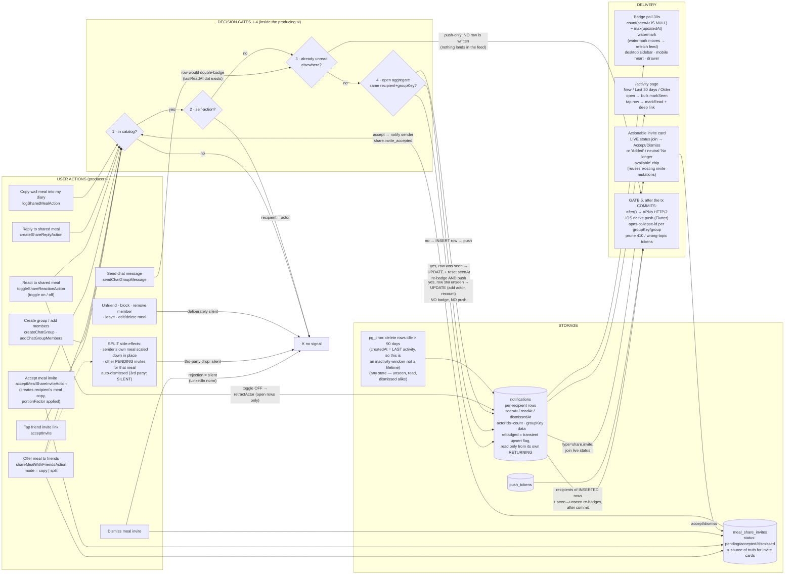
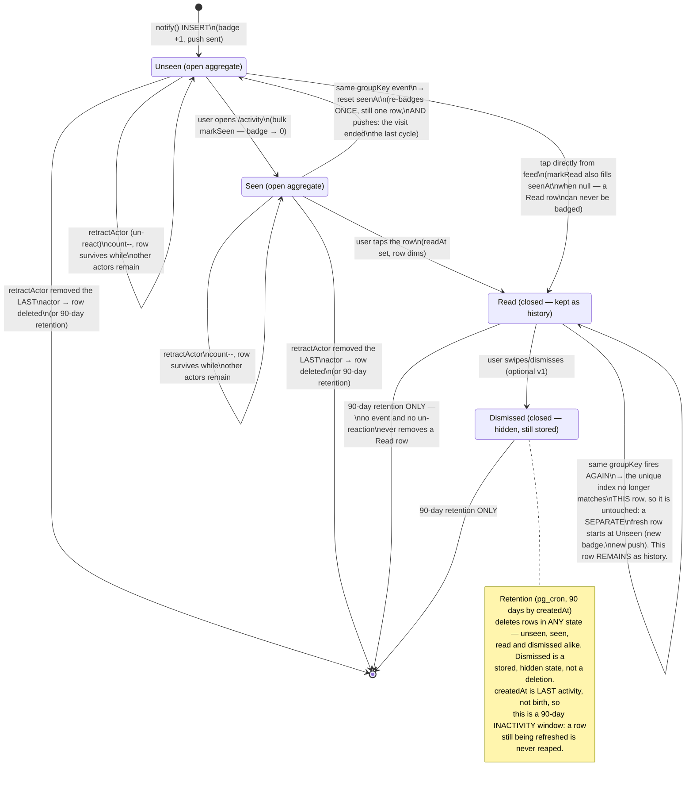

# Notifications — technical design

Status: v1 design, implemented on `claude/notification-system-design-ga76n4`.

## Context

Kallo's social layer (Circle: friends, group chats, shared meals, copy/split invites) is almost entirely **silent**: the inviter never learns someone joined via their link, group adds give no notice, reactions/replies/meal-copies produce zero signal, and meal-share invite accepts never reach the sender. The only unread machinery is two timestamp read-markers rendered as boolean dots. There is no notifications table, no push, no activity page.

Goal: a **Threads/Instagram-style Activity page** (web, mobile-responsive) backed by a properly designed notification system — informed by how Slack/Instagram design theirs — plus a server-side push pipeline so the Flutter iOS app gets native notifications.

## Decisions (user-confirmed + research-resolved)

1. **Group adds** stay instant; the added member gets a `group.added` notification deep-linking to the group (leave stays in group info). Locket model: notify, don't gate.
2. **Friend connect** stays instant-on-link; NEW `friend.joined` notification to the inviter. Research (Locket/Instagram/BeReal/Snapchat/Discord/LinkedIn/Venmo) showed: a personally shared private link counts as consent; request/approve exists to guard *discovery* surfaces (search/contact sync), which Kallo doesn't have. The schema's unused `friend_request` slot stays reserved for a future discovery path. Link expiry/revocation = separate follow-up.
3. **Entry points**: desktop sidebar "Activity" item + heart button with unread badge in the mobile header (both → `/activity`); mobile drawer row also gets the badge.
4. **Channels v1**: web = in-app only via TanStack polling (Supabase Realtime is deliberately deferred repo-wide; data plane locked by `20260825120000_lock_postgrest_data_plane.sql`). Flutter iOS = native push straight to **APNs** (no Firebase anywhere) — this repo ships the token API + send pipeline; Flutter client work is contract-only here (separate branch later).

## Design principles (from big-tech research)

- **Slack**: ordered short-circuit decision gates; sparse preference overrides; push only when not active in-app. V1 has no prefs UI, but the dot-namespaced type taxonomy (`category.event`) lets a `notification_prefs(user_id, category, channel)` table bolt on later with zero data migration.
- **Instagram tri-state**: `seenAt` (badge = count where null; bulk-cleared on opening Activity), `readAt` (per-item on tap → dim), sections "New / Last 30 days / Older" are presentation-only.
- **Aggregation**: upsert on `(recipientId, groupKey)` partial unique index while the row is open — "X and 2 others reacted". `actorIds` holds the aggregate's **full** deduplicated membership, newest first, and `actorCount` is derived from it (`cardinality`), so the total is exact and any actor can be retracted. Audiences are bounded (≤10 friends, ≤50 group members), so the array stays small; the UI renders the first two faces.

  **Accepted limit — the membership array is operationally unbounded, not bounded.** `actorIds` tracks everyone who has *ever* acted on the open aggregate. The ≤50 cap is an *instantaneous* bound on who can act right now; it does not bound the historical set, because membership churns — someone joins the group, reacts, leaves, and stays in the array forever, and the next person to join can do the same. Retention does not bound it either, and the design does not claim it does: every refresh resets `created_at`, so the 90-day cron caps an open aggregate's *inactivity*, not its lifetime. In principle, then, a row the recipient never opens on an object that keeps churning members can grow its array without a stated ceiling.

  This is accepted rather than guarded, on three grounds and no stronger claim than they support: an aggregate closes the moment the recipient reads it, which is the normal case and resets the array; retention reaps a row that stops receiving activity for 90 days; and realistic churn on a ≤50-member group over an unread aggregate's life is a handful of people, not thousands. The rendering guard is client-side — the row slices to the first two faces regardless of array length. If the audience caps ever move by an order of magnitude, or if a growth incident is ever observed, a `[1:N]` slice on the SET clause is the one place to add a hard ceiling.
- **Actionable notifications** (the copy/split invite) reference the domain object, never own state: render live `meal_share_invites.status`; resolved elsewhere → buttons collapse to a status chip; mutations reuse the existing idempotent accept/dismiss actions.
- **Fan-out on write** (single per-recipient table): audiences are ≤10 friends / ≤50 members. 90-day retention via pg_cron.

## Holistic system diagram (end-to-end)

Every producer (including all meal copy/split paths), the decision gates, the storage, and every delivery surface in one picture:



Reading the picture: gates 1–4 all run **inside the producing transaction**, so a notification can never exist for a domain write that rolled back — the `notify()` upsert is part of the same tx. Gate 5 (push) runs **after that tx commits**, via `after()`, for the recipients whose row was freshly INSERTED plus those whose event re-badged an already-seen row. `chat.message` short-circuits at gate 3 into push only: **no notification row is ever written for it**, so it never appears in `/activity` and never touches the badge — the group's existing `lastReadAt` dot is its unread surface.

## Notification lifecycle — FSM

Every notification row moves through this machine. The aggregation transitions (`refresh`/`retract`) are the anti-flood mechanism; the tri-state read model is the anti-starvation mechanism (nothing silently disappears — it must be seen, then read).

**"Open aggregate" is defined once, here, and used with exactly this meaning everywhere below:** a row with `read_at IS NULL AND dismissed_at IS NULL` — precisely the predicate of the partial unique index. **Seen rows are open**: `seen_at` plays no part in it. A new event on an open row aggregates into it, and `retractActor` can still remove an actor from it. Reading (or dismissing) a row is what closes it; a later event then starts a fresh row.

A row leaves this machine on exactly two edges: 90-day retention deletes it (from any state), or a retraction takes its last actor away. Reading and dismissing are *states*, not exits — the row stays stored.



Key invariants encoded above:
- **One open aggregate per `(recipient, groupKey)`** — enforced by the partial unique index (`WHERE read_at IS NULL AND dismissed_at IS NULL`). 10 people reacting to your meal = **1 row**.
- **At most one badge event per open aggregate per visit cycle.** The INSERT badges. Every later event that lands on the still-unseen row refreshes it silently. Once the user has visited (row seen) the next event resets `seen_at` and re-badges — once — and that is a new cycle. So the badge count is "how many conversations have something new since your last visit", not "how many events happened".
- **At most one push per open aggregate *per visit cycle*** — `notify()` returns the recipients whose row it INSERTED **plus** those whose event re-badged a row that had already been SEEN; a refresh of a row that is still unseen returns nobody. So the device knocks when an aggregate opens, stays quiet for the second through eighth reaction you have not looked at yet, and knocks again on the first event after you have looked. Push and badge therefore fire on exactly the same edges — **one push per badge edge, under concurrency too, and by construction rather than by argument**: the classification is computed *inside* the one `INSERT ... ON CONFLICT` statement (`rebadged` ← the OLD row's `seen_at IS NOT NULL`, written in the same SET clause that resets `seen_at`) and read straight back out of that statement's `RETURNING`. There is no window between deciding and resetting for another transaction to fall into. Two simultaneous events on the same seen row serialise on the row itself: the loser waits for the winner's commit, reads `seen_at IS NULL`, and calls itself a silent refresh. Two simultaneous events on a *missing* row are arbitrated by the open-aggregate unique index: the loser blocks on the index entry, takes the conflict branch, and comes back with neither `xmax = 0` nor `rebadged`. The in-app row is the durable record; the push is only the knock.
- **Read rows are immutable history and are never deleted by a new event** — `retractActor` and refresh never touch them (Instagram behavior: un-liking doesn't rewrite the past; a new like after you've read starts a *separate* fresh row while the old one stays in the feed). Seen-but-unread rows are *not* history: they are open, and both refresh and retract still apply to them.
- **Reading implies seeing** — `markRead` sets `read_at` and fills `seen_at` when it is null (`lib/actions/notifications/state.ts`), so tapping a row straight out of an unseen feed cannot leave the badge stuck counting a row the user has already opened. A Read row is never badged.
- **Badge = count(seenAt IS NULL)**; opening Activity zeroes it in bulk; per-row `readAt` only controls bold/dim.
- **`created_at` is the aggregate's *latest* activity, not its birth** — a refresh resets it so the row jumps back to the top of the feed. Consequences: the feed is ordered by recency of activity (intended); retention is an **inactivity** timer rather than a lifetime cap, so a continuously active open aggregate is never reaped (intended, and the reason the membership-growth bound above is the product cap, not the cron); and mid-scroll re-ordering is possible (see the pagination tradeoff under mark-seen).

### Badge clearing (`markSeen`) — deliberate Instagram semantics

Opening `/activity` posts `markSeen(maxCreatedAt of the first page)` — **gated on the feed response, never on the badge poll** — which clears `seen_at` for **every** unseen row at or before that timestamp — including rows the user never scrolled to, on pages that were never fetched. That is intentional, and it is what Instagram does: the badge answers "is there anything new since you last looked", and *looking* is the whole gesture. A badge that survived the visit because page 3 was never reached would be unclearable without infinite scrolling.

**What decides there is anything to clear is the fetched feed itself** — `unseenCount` on the page the GET returned, or any loaded item whose `seenAt` is null. The badge query is a *separate* 30-second poll with its own cache, so a notification that commits between two polls is rendered on this page while the cached count still reads zero; gating the effect on that count would show the row and never mark it seen, leaving a badge stuck on a page the user is looking at. The one-shot ref guard still applies: mark-seen invalidates this very query, so without it the refetch would post again every round trip.

Two consequences worth naming:

- **The "New" section is a client-held snapshot, not a live read of `seen_at`.** The mark-seen call invalidates the feed as well as the badge, so re-reading `seen_at` would empty the section a round trip after it painted. `activity-sections.tsx` freezes the ids that were unseen on first render, so rows keep their tint for the whole visit.
- **A row can be cleared without the client ever having seen it (accepted).** The bound is `created_at <= maxCreatedAt of the page the client just fetched`, and the mark-seen call happens a round trip later. A row that commits in between — after the GET, before `markSeen`, with a `created_at` at or below the bound — is cleared server-side while never appearing in the client's unseen snapshot. It therefore comes back on the next feed load with no "New" tint and no badge contribution. Under badge-clearing intent that is acceptable: the gesture the user made was "I have looked", the row itself is never lost, and the alternative (a badge that outlives the visit) is worse. Equal timestamps fall out of the same rule.

**Pagination tradeoff (accepted).** Because a refresh resets `created_at`, an aggregate can move *above* the cursor a reader has already scrolled past, and the in-flight pagination misses it. The badge poll is what recovers it, and it is driven by an **activity watermark, not by the count**: `GET /api/v1/notifications/badge` answers `{unseen, latestActivityAt}`, where `latestActivityAt` is `max(updated_at)` over the caller's undismissed rows, and `useNotificationBadge` invalidates `notificationKeys.feed` whenever that value *changes* between polls. The count alone is not enough: a silent refresh of an *already-unseen* aggregate re-surfaces the row without changing `unseen`, so a count-increase rule would miss exactly the cursor jump it exists to heal. Every write path touches `updated_at`, so the watermark moves on every aggregation edge and strictly subsumes the count rule. The re-surfaced row is therefore refetched within 30 seconds and lands at the top where it belongs — no separate feed poll needed. This is standard for any re-surfacing feed (Instagram, Slack activity) and is accepted: nothing is lost, only briefly out of view. (`markSeen`/`markRead` deliberately do **not** touch `updated_at` — the client already invalidates on those, and moving the watermark would make every visit look like new activity.)

**First observation — compare against the cache, and when there is no cache yet, HOLD rather than baseline.** A poll that has no previous watermark to compare with cannot simply record the value and stay quiet, or one specific wakeup is lost: the feed GET completes, an event commits, and the *first* badge poll already carries the moved watermark. Baselining it would leave the page rendering a feed that is known-stale right there, with nothing to invalidate it until some later unrelated activity moved the watermark again — potentially not for hours. So the first observation reads the cached `notificationKeys.feed` pages and compares the watermark against the newest `updatedAt` among their items: strictly newer means the cached page missed something, and the feed is invalidated.

With **no** feed in cache the comparison cannot be made *yet*, and the usual reason there is none is that the feed request is still open — precisely the window in which its response is about to land already stale (the event commits after the server built the page but before the badge poll answers). Baselining there would swallow exactly that case: the in-flight response would populate the cache uninvalidated, and since nothing needs to move the watermark again, nothing would ever heal it. So the watermark is **held** in a ref instead of consumed, and judged the moment a feed page reaches the cache: strictly newer than the settled page's newest `updatedAt` → invalidate; otherwise drop it. Either way the held value is cleared once, so it can never fire twice, and a later watermark *movement* clears it too (the movement rule has already invalidated).

**Healing latency, stated honestly:** the resolution is driven by a query-cache subscription, not by the 30-second poll, so it fires on the settle that populates the feed — one extra render, not one extra poll cycle. The subscription is scoped to the badge hook's effect and torn down with it. Mounting still never invalidates a fetch in flight: nothing is invalidated *while* the feed is uncached, only after it has settled and been shown to be behind. Every observation after the first keeps the plain movement rule.

**Accepted limit — the watermark is a non-strict version token, not an airtight one.** `max(updated_at)` is built from transaction timestamps (`now()` is the transaction start time in Postgres), so it does not totally order commits: two writes can carry equal timestamps, and a transaction that started earlier can commit later, which means a write can land without moving the watermark past what a reader already observed. There is no attempt here to make it strict — no sequence, no logical clock. It is accepted because it is not the durable record and nothing depends on it for correctness: the in-app row is written either way and is what the feed renders. The invalidation is only a freshness hint, and a missed one heals on any subsequent activity, on the next 30-second poll after that activity, and on any mount-time refetch of the feed. The failure mode of a miss is a row that shows up a little later than it could have, never a row that is lost.

## Decision pipeline — "should this event notify?" (Slack-style ordered gates)

Every producer event flows through these short-circuit gates; each gate exists to prevent a specific flood or gap:

Gates 1–4 execute **inside the producing transaction**, alongside the domain write; gate 5 executes **after that transaction commits**.

```mermaid
flowchart TD
    E[Domain write, inside its tx] --> G1{Gate 1 — Relevance\nIs the type in the v1 catalog?}
    G1 -- "no (unfriend, block, removal,\nleave, edit, dismiss)" --> X1[Silent by design]
    G1 -- yes --> G2{Gate 2 — Self-notification\nrecipient == actor?}
    G2 -- yes --> X2[Skip: never notify\nyourself]
    G2 -- no --> G3{Gate 3 — Double-badging\nDoes another surface already\ncarry this unread state?}
    G3 -- "chat.message → the group's\nlastReadAt dot already carries it" --> P[Push-only path:\nNO row, NO badge,\nnothing in /activity —\nskips the whole row branch]
    G3 -- no --> G4{Gate 4 — Aggregation\nOpen row for same\nrecipient + groupKey?\nopen = read_at IS NULL\nAND dismissed_at IS NULL}
    G4 -- "yes, and it is still UNSEEN\n(not looked at yet)" --> U[ON CONFLICT branch: add actor,\nrecount, re-surface\nrebadged := old seenAt IS NOT NULL\n= false → SILENT refresh]
    G4 -- "yes, but it was already SEEN\n(looked at since it last badged)" --> RB[ON CONFLICT branch: add actor,\nrecount, reset seenAt\nrebadged := true in the SAME\nstatement → RE-BADGE, new visit cycle]
    G4 -- no --> I[INSERT branch: new row → Unseen\nxmax = 0, rebadged = false]
    U --> C1
    RB --> C1
    I --> C1[In-app: the row is live on\nthe next 30s badge poll]
    U -.-> X4[No push — the device already\nknocked for this aggregate\nand the user has not looked yet]
    I --> G5{Gate 5 — Channel routing\nAFTER the tx commits.\nPush set = RETURNING rows where\ninserted OR rebadged}
    RB --> G5
    G5 --> C2{Push eligible?\ntoken registered\n+ APNS_* configured}
    P --> C2
    C2 -- yes --> S[after&#40;&#41; fire-and-forget\nAPNs send, apns-collapse-id\nper groupKey / chat group]
    C2 -- no --> X3[In-app only]
```



**Gate 5 fires on the same edges the badge does.** `notify()` reports back the recipients whose row Postgres actually inserted (`RETURNING (xmax = 0)`) **plus** those whose event landed on an already-SEEN open row, and `withNotifications` queues exactly that list for the single post-commit `after(() => sendNotificationPush(...))`. An event that aggregated into a row the recipient has not looked at yet updates the feed silently — otherwise the eighth reaction on a meal you have not opened would be the eighth push — but once the visit has ended that cycle, the next event knocks again rather than re-badging into a device that stays quiet. `chat.message` never enters the row branch at all: it is push-only by design, writes nothing, and joins the flow at the APNs eligibility check.

**How the two are told apart — one statement, no pre-select.** The upsert classifies *itself*. The `ON CONFLICT DO UPDATE` SET clause writes a `rebadged` boolean column from the OLD row — `rebadged = (notifications.seen_at IS NOT NULL)` — in the same expression evaluation that sets `seen_at = NULL`, and the INSERT branch stamps `rebadged = false` because a row that did not exist was never seen. `RETURNING (xmax = 0) AS inserted, rebadged` then hands both bits back, and the push set is `inserted OR rebadged`. There is no pre-select, no `FOR UPDATE`, and no row lock beyond the ones the upsert takes for itself.

That single-statement shape is what makes it correct rather than merely usually-correct. A separate classifying `SELECT` — even `FOR UPDATE` — cannot lock a key that is *absent*, so it leaves a real race: A pre-selects nothing, B inserts, the recipient marks the row seen, and A's conflict branch then resets `seen_at` while its map still says "no open row", producing a badge edge with no push. Reading the old row inside the conflict branch has no such hole: whichever transaction gets there second is looking at the first one's committed tuple, because that is the tuple it is updating. Two events on a SEEN row → one push (the loser sees `seen_at IS NULL`). Two events on a MISSING row → one push (the unique index arbitrates; the loser gets `xmax ≠ 0` and `rebadged = false`). A concurrent `markSeen` interleaves either way round and both orderings are right by inspection: before the upsert, the upsert re-badges and pushes; after it, the upsert was a silent refresh and the visit simply cleared the badge.

The one ordering that still has to be stated is between the upsert's own index-entry acquisitions: a multi-row round takes one open-aggregate unique-index entry per row, and caller order is arbitrary, so the VALUES are **sorted by `(recipientId, groupKey)`** before the statement is issued. Two concurrent `notify()` transactions with overlapping rounds therefore acquire their shared entries in the same order and cannot invert on each other.

Calibration ("not excessive, not minimal") per type:
- **High-signal, always individual**: `friend.joined`, `group.added`, `share.invite`, `share.invite_accepted` — each is a distinct human action toward you; never collapsed across objects.
- **Aggregated per object**: `share.reaction`, `share.reply`, `share.logged` — collapse to "X and N others…" per meal while open; a burst of activity on one meal is one badge, not N.
- **Suppressed entirely**: rejection signals (invite dismiss — LinkedIn norm), self-actions, anything already carried by another unread surface (`chat.message` rows), and all deliberately-silent events (Gate 1).
- Future prefs bolt onto Gate 5 as a per-category channel filter without touching Gates 1–4.

## Actionable invite sub-FSM (`share.invite` card)

The notification never owns this state — it renders `meal_share_invites.status` live (joined at list time), so acting from the Circle page, the Activity page, or another device stays consistent:

```mermaid
stateDiagram-v2
    [*] --> Pending : offer created (mode = copy | split)\ncopy → invitee gets full-portion offer\nsplit → portionFactor set AND sender's own\nmeal scaled down in place immediately
    Pending --> Accepted : accept (here or anywhere)\nguarded UPDATE WHERE status='pending'\n→ meal copy created in invitee's diary\n(portionFactor applied) → buttons collapse\nto "Added" chip → sender notified\n(share.invite_accepted)\n→ share.invite row CLOSED in the same tx
    Pending --> DismissedI : dismiss (here or anywhere)\n→ neutral "No longer available" chip,\nsender NOT told\n→ share.invite row CLOSED in the same tx
    Pending --> DismissedI : AUTO-dismiss — sender split the\nsame meal with someone else\n(3rd party silently dropped, no signal;\nsame neutral chip — the client cannot\ntell the two apart, so it must not\nsay the reader dismissed it)\n→ their share.invite row CLOSED in that split tx
    DismissedI --> Pending : sender re-shares\n(upsert re-pends; notification refreshes\nif open, else fresh row per lifecycle FSM)
    Accepted --> Accepted : re-share is a no-op\n(never resets an accepted invite)
```



Invariants for this sub-FSM:

- **Accept is a guarded `UPDATE ... WHERE status = 'pending'` inside the accept transaction** (`invite-response.ts`, after a `FOR UPDATE` lock on the source meal). Two taps, two devices, or a tap racing an auto-dismiss all resolve to one winner: the loser's statement matches zero rows, the whole tx rolls back with "already handled", and no second meal copy can be materialized. Race-safe and idempotent by construction — which is why the notification card can be a thin renderer of `meal_share_invites.status` and why acting from Circle, Activity, or another device stays consistent.
- **Auto-dismiss of third parties happens inside the sender's split transaction** (`share-with-friends.ts`): the same tx that scales the sender's meal down also dismisses every *other* still-pending invite for that meal, because accept copies the source verbatim and would otherwise hand a straggler the halved portion under a "full copy" label. It is never a follow-up write, so there is no window in which a third party can accept the stale offer.
- **Resolution closes the notification server-side, in the same transaction as the status transition.** The invite is the one actionable card, and the notification never owns its state — so closing it is a *domain* event, not a UI one. `closeAggregates(tx, {recipientIds, groupKey})` (`lib/domain/notifications/notify.ts`) stamps `read_at = now()`, `seen_at = COALESCE(seen_at, now())` on those recipients' rows for that key where they are still open, and it is called inside **every** resolution path: the guarded accept and the guarded dismiss (`invite-response.ts` — the dismiss became transactional for exactly this), and the split's third-party auto-dismiss sweep (`share-with-friends.ts`, one call for the whole sweep). Callers pass `shareInviteKey(sourceMealId)` themselves, so the helper carries no knowledge of invites or meals. That covers the paths no card can see: accepted from the Circle page, dismissed on another device, or auto-dismissed under a third party who never touched it. Without it `read_at` stays null forever — the aggregate never closes, and a later re-offer lands on that same open row and **rewrites** it instead of inserting fresh history beside it, contradicting the "read rows are immutable history" invariant of the lifecycle FSM. The predicate is `read_at IS NULL AND dismissed_at IS NULL`, so closing is idempotent: an accept racing an auto-dismiss, a retried mutation, or a second close matches zero rows rather than restamping.
- **The Activity card's `markRead` stays, as the optimistic half.** `share-invite-row.tsx` still marks the row read on success (fire-and-forget, feed invalidation chained to its settle) so the card dims without waiting for a refetch; against the server predicate it is a harmless no-op double close. Resolved cards render a static chip and stay unread by design (there is nothing to act on).
- **The dismissed chip is deliberately neutral.** That auto-dismiss is silent by design (no rejection signal), and the third party's card would otherwise read "Dismissed" for something they never did; see the deferred-decisions note below.
- **NOTE, not fixed here:** the split ↔ meal-rescaling interaction (re-sharing a split of the same meal, and the compounding shrink it would cause) is pre-existing meal-sharing domain behaviour. Today it is refused up front by the `portionFactor < 1` guard, and any residual edge around re-shares lives in the sharing domain, not in this notification system — flagged for follow-up rather than changed under this design.

## Event catalog v1

| Type | Recipient(s) | Producer (existing fn) | Notes |
|---|---|---|---|
| `friend.joined` | inviter | `acceptInvite` — `lib/actions/groups/friendship.ts` | notify on the two edge-establishing paths; race-reconcile path stays silent |
| `group.added` | added members (not actor) | `createChatGroup` — `lib/actions/chat-groups/create-and-list.ts`; `addChatGroupMembers` — `membership.ts` | `data:{groupName}`, deep-link `/circle/g/[id]` |
| `share.invite` | invitee | `shareMealWithFriendsAction` — `lib/actions/meal-sharing/share-with-friends.ts` | **actionable** accept/dismiss inline |
| `share.invite_accepted` | sender | `acceptMealShareInviteAction` — `invite-response.ts` | dismiss stays silent (LinkedIn norm: no rejection signal) |
| `share.reaction` | meal owner | `toggleShareReactionAction` — `reactions.ts` | aggregate per share; un-react retracts from *open* aggregate only |
| `share.reply` | owner + prior repliers, minus author | `createShareReplyAction` — `replies.ts` | aggregate per share per recipient; `data:{previewBody}`; notifies **only when the insert created the row** (see idempotency note below) |
| `share.logged` | meal owner | `logSharedMealAction` — `log-shared.ts` | aggregate per share |
| `chat.message` | group members minus sender | `sendChatGroupMessage` — `messages.ts` | **push-only, no row** (unread already exists via `chat_group_members.lastReadAt` — avoid double-badging); audience captured at write time (see below) |

**Producer idempotency — a retry notifies nobody.** `createShareReplyAction` takes a client-supplied `replyId` and inserts it `ON CONFLICT DO NOTHING`, so a retry of the same request loads the row the first attempt already wrote. That path must skip `notify()` entirely: the original insert notified, and running the fan-out again would refresh the aggregate a second time (re-badging a recipient who had since looked) and republish the preview. It would also let the *retry's* body rewrite the preview of text that is already stored, so where a notification quotes a row, it quotes the **persisted** column (`reply.body`), never the parsed request body. Nothing is queued on the skip path, so the scheduled `after()` drains an empty queue. Any future producer that grows an idempotency key inherits the same rule: **notify on the create edge only.**

**Push audiences that have no row are captured at write time.** `chat.message` is the one event whose recipients are not computed by `notify()` inside the producing transaction (Gate 3 — it writes no row). They must therefore be selected **atomically with the message write** and handed to `sendChatMessagePush({..., recipientIds})`. Querying `chat_group_members` inside the `after()` callback instead would read the membership as it stands *after* the commit, so somebody who joined in the interim would receive a lock-screen preview of a message sent before they were in the room. Moving the select into the producer's scope narrows that window but does not close it — under READ COMMITTED each statement takes a fresh snapshot, so a join committing between the insert and the select is still visible to the select. What closes it is `sendChatGroupMessage` running all three statements in **one transaction ordered bump → insert → audience**: the `chat_groups.updated_at` bump takes that row's write lock first, and every membership change (`addChatGroupMembers`, `removeChatGroupMember`) opens with the same `lockChatGroup` FOR UPDATE, so a concurrent join is serialised entirely before the message exists or entirely after the audience was read. `push.ts` takes the list as given and only loads tokens and locales for it.

Deliberately silent: unfriend, block, member removal, leave, meal edit/delete, invite dismiss. Reserved types (pre-widened CHECK): `coach.nudge`, `streak.milestone`, `recap.ready`.

`circle_events` stays as-is (actor-scoped spine, no recipient column) — the new `notifications` table is the per-recipient layer; do not conflate them.

---

## Phase 1 — Schema + helper + producers (ships silently: rows accumulate, nothing reads them)

**Schema** (edit `lib/infra/db/schema.ts`, then `bun db:generate`; NEVER `dbr:push`/`dbr:reset` — user applies migrations):

`notifications`: id uuid PK, recipientId (FK auth.users cascade), type text, actorIds uuid[] (full membership, newest first), actorCount int (= `cardinality(actorIds)`), objectType/objectId, targetType/targetId, groupKey text, data jsonb, createdAt/updatedAt, seenAt, readAt, dismissedAt, rebadged bool NOT NULL DEFAULT false (added by `20260829080007_notifications_rebadged`).

`rebadged` is **transient per-upsert classification state, not domain state**: the aggregation upsert writes it from the OLD row's `seen_at` and reads it back in the same statement's `RETURNING`, and nothing else in the system ever reads it. It is a stored column only because `RETURNING` can return columns and not arbitrary expressions over the pre-update tuple. No RLS change — the table is already `ENABLE ROW LEVEL SECURITY` with no policies (server-only).
Indexes: `(recipientId, createdAt DESC, id DESC) WHERE dismissed_at IS NULL` (feed cursor); `(recipientId) WHERE seen_at IS NULL AND dismissed_at IS NULL` (badge); **unique** `(recipientId, groupKey) WHERE read_at IS NULL AND dismissed_at IS NULL` (aggregation upsert target); CHECK on type list (pre-widened incl. reserved types).

**Hand-written SQL** (new files in `supabase/migrations/`, append-only, manual timestamps):
- `..._rls_notifications.sql` — `ENABLE ROW LEVEL SECURITY`, no policies (server-only access; mirrors `meal_share_replies` — grants already revoked by the lock migration).
- `..._notifications_retention.sql` — SECURITY DEFINER `reap_old_notifications()` deleting rows > 90 days, scheduled via the guarded pg_cron `DO` block copied from `20260430201543_pipeline_requests_privacy.sql`.

**Helper** — new `lib/domain/notifications/`:
- `types.ts` — `NotificationType`, `NotifyInput { recipientId, type, actorId, objectType?, objectId?, targetType?, targetId?, groupKey, data? }`.
- `notify.ts` — `notify(tx, inputs[]): Promise<string[]>`: skips self (recipient===actor), Drizzle `onConflictDoUpdate` against the partial unique index — prepend the actor into the deduplicated **full** membership array (no cap: audiences are bounded), recompute `actorCount` as its `cardinality`, reset `seenAt`/`createdAt` so aggregates re-badge and re-surface. **Returns the push set: recipients whose row was INSERTED** (`RETURNING (xmax = 0)`) **plus those whose event landed on an open row that had already been SEEN** — both bits produced by the upsert itself: the SET clause also writes `rebadged = (notifications.seen_at IS NOT NULL)` from the old row alongside `seen_at = NULL`, the INSERT branch supplies `rebadged = false`, and `RETURNING` hands back `inserted OR rebadged`. No pre-select and no `FOR UPDATE`; the only stated ordering is that each round's VALUES are sorted by `(recipientId, groupKey)` so concurrent multi-row upserts acquire the open-aggregate index entries in one deterministic order. This is the Phase 4 push list, so a device is knocked once per open aggregate per visit cycle. `retractActor(tx, {recipientId, groupKey, actorId})` for un-react: remove the actor, decrement, delete at zero; applies to any OPEN row (seen ones included) and is a no-op on read/dismissed rows (Instagram behavior).
- `group-keys.ts` — pure key builders (`'share.reaction:'+shareId`, etc.), unit-tested.
- `notify.ts` also exports `closeAggregates(tx, {recipientIds, groupKey})` — the write path's counterpart to `notify()` for the one ACTIONABLE type. One recipient-scoped UPDATE stamping `read_at`/`seen_at` on the open rows for that key, called inside each invite status transition's own transaction so **every** resolution closes the aggregate — the Activity card, the Circle page, another device, or a split's auto-dismiss (see the invite sub-FSM). Idempotent by its `read_at IS NULL AND dismissed_at IS NULL` predicate.
- `with-notifications.ts` — `withNotifications(db, (tx, notify) => …)`: the wrapper every row-writing producer runs its transaction through. It opens the transaction, hands the producer a scoped `notify` that writes the rows and QUEUES the push each call earned, and schedules one `after()` draining that queue only once the awaited transaction has resolved. That is what makes "push strictly after commit" structural rather than a convention repeated at eight call sites.

**Producer wiring** (7 files above, all inside the existing tx; carry recipient ids out of the tx closure — small mechanical refactor where actions `return db.transaction(...)` directly). Two writes were made transactional *by* this wiring rather than merely joined to an existing tx:
- `dismissMealShareInviteAction` — was a bare guarded UPDATE; now `db.transaction` so the dismiss and its notification close commit together (a dismiss without the close leaves an open aggregate for an offer that no longer exists).
- `sendChatGroupMessage` — the message insert, the `chat_groups.updated_at` bump and the push-audience member select now share one transaction, in that order. Sharing a transaction is not on its own sufficient (READ COMMITTED re-snapshots per statement): the bump takes the `chat_groups` row write lock **first**, and every membership change opens with the same `lockChatGroup` FOR UPDATE, so a concurrent join lands entirely before the message exists or entirely after the audience was read. Without it a member who joined mid-write was handed a push preview of a message sent before they were in the room.

Tests: `lib/domain/notifications/__tests__/` (input shaping, conflict-key spreading, the three push-set outcomes — insert, seen re-badge, silent refresh — self-skip, retract paths, and the invite-close predicate: recipient scoping, source-meal key, open-rows-only) + per-producer recipient assertions in existing action test folders (including that each invite resolution path fires the close, and that the chat audience is captured inside the write transaction).

## Phase 2 — API + hooks

- **Contracts**: `lib/domain/notifications/contracts.ts` (isomorphic Zod — placed here, NOT `lib/api/contracts/`, which already has 10 direct files and would trip the ≤10-files structure rule): list query `{before?, limit≤50}`, markSeen `{before: datetime}`, markRead `{ids: uuid[]≤50}`, pushToken `{token, platform: 'ios'}` (iOS-only — APNs is the sole transport). Response item: id, type, actors (hydrated `PublicIdentity[]`), actorCount, object/target refs, data, timestamps, and for `share.invite` a live-joined `invite: {status}`.
- **Actions**: `lib/actions/notifications/list.ts` (recipient-scoped, tuple cursor reusing `lib/domain/social/feed/cursor.ts` helpers, actor hydration via `lib/domain/social/identity/public-identity.ts`, left-join `meal_share_invites` for invite rows); `state.ts` (`readBadgeState` — one aggregate query returning `{unseen, latestActivityAt}`, bulk `markSeen(userId, before)`, `markRead(userId, ids)` — every query carries `recipientId`: the Drizzle handle **bypasses RLS**).
- **Routes** (v1 REST so Flutter shares them, `requireUserId` + `handleRouteError` pattern): `GET /api/v1/notifications` (returns `{items, nextCursor, unseenCount}`), `GET /api/v1/notifications/badge` (returns `{unseen, latestActivityAt}`), `POST .../seen`, `POST .../read`.
- **Client**: `lib/domain/notifications/client.ts` (via `lib/api/client-fetch`); `lib/domain/notifications/query-keys.ts` (`notificationKeys.feed/badge`).
- **Hooks** — new `hooks/notifications/`: `use-notification-feed.ts` (`useInfiniteQuery`, staleTime 30s, per `use-friend-thread-feed.ts`), `use-notification-badge.ts` (`refetchInterval: 30_000`, exports `useUnseenNotificationCount()` mirroring `useMealShareInviteCount`), `use-notification-state.ts` (mark-seen invalidates badge and feed; mark-read optimistic). The badge poll is the **only** timer in the client, so it doubles as the feed's liveness signal: when a poll returns a `latestActivityAt` *different* from the previous one it invalidates `notificationKeys.feed`, which is how a re-surfaced aggregate reaches an open Activity page. The watermark, not the count, is the trigger — a silent refresh of an already-unseen row moves it above the reader's cursor without moving `unseen`, so a count-increase rule would miss the very case this exists for. The first observation after mount has no previous value to compare with (and `null` — an empty inbox — is a real observed value, so the sentinel is `undefined`), so instead of baselining blind it compares the watermark against the newest `updatedAt` in the cached feed pages and invalidates only when the watermark is strictly newer; with no cached feed the comparison is not possible yet, so the watermark is **held in a ref** and re-judged the moment a feed page lands (via a query-cache subscription scoped to the same effect), which is what stops an in-flight response from settling stale and uninvalidated. Mounting still cannot invalidate the fetch the page is in the middle of — nothing fires until that fetch has settled. See the first-observation rule under the pagination tradeoff.

Tests: schema round-trips, cursor pagination, invite live-status join, recipient-scoping (foreign id untouched), route 401/400.

## Phase 3 — Activity UI + nav + badges

**Page**: `app/[locale]/(app)/activity/page.tsx` (server shell) → `components/activity/` (all ≤200 LOC):
- `activity-page.tsx` — orchestrator; v1 has **no tabs** (volume is tiny; invite cards sit inline like Instagram's follow-request row; `view-switcher.tsx` pill tabs bolt on later). Mark-seen effect: after first page load, if the FEED response shows anything unseen (`unseenCount > 0`, or any loaded item with `seenAt === null`) → `postMarkSeen(maxCreatedAt)` → invalidate badge. Deliberately not gated on `useUnseenNotificationCount()`: that badge cache lags its own poll and would skip a row this page is already rendering.
- `activity-sections.tsx` — New / Last 30 days / Older buckets, presentation-only; "New" = `seenAt` null **in a client-held snapshot** (a ref of the ids that were unseen the first time they rendered — `useMarkNotificationsSeen` invalidates the FEED as well as the badge, so a live re-read of `seenAt` would empty the section a round trip after it painted) (so rows don't jump sections mid-visit); infinite scroll via the `thread-feed.tsx` IntersectionObserver idiom (don't reuse ThreadFeed itself — wrong strings/separators).
- `notification-row.tsx` — the avatar stack and message line come from `notification-parts.tsx` (shared with `share-invite-row.tsx`): `ProfileAvatar` stack (≤2), message from the `row.<type>.<one|other>` i18n templates with `{name}/{count}` interpolation, `formatElapsed` timestamp, unseen dot, whole row = `Link` (i18n navigation, never next/link): `friend.joined|share.*` → `/circle`, `group.added` → `/circle/g/[id]`; tap fires mark-read fire-and-forget.
- `share-invite-row.tsx` — actionable card: `invite.status==='pending'` → Accept/Dismiss reusing `useAcceptMealShareInvite`/`useDismissMealShareInvite` (styling from `meal-invites.tsx`), success marks the row read (`useMarkNotificationRead`) and invalidates `notificationKeys` on that mutation's settle so the card dims without waiting for a refetch. That markRead is the **optimistic** half only: the durable close is server-side, in the accept/dismiss transaction itself (`closeAggregates`), which is what covers resolutions this card never sees. Against the server's `read_at IS NULL` predicate the client call is a harmless second close. Otherwise status chip.
- Empty state via `components/shared/surface-state/surface-state.tsx` (`area="circle" kind="emptyAlt"`).

**Nav** (verified against code):
- `nav-items.ts`: add `{ id: 'activity', href: '/activity', labelKey: 'activity', icon: Heart }` — **not** Lucide `Activity` (taken by nutrition, nav-items.ts:29).
- `desktop-sidebar.tsx` / `mobile-nav-list.tsx` / `mobile-nav.tsx`: all three read `useNavBadgeCounts()` (`hooks/ui/use-nav-badges.ts`), a `Record<navItemId, count>` of the pending-invite and unseen-notification counts, so the rail, the drawer row and the header heart can never disagree about which destination carries unread state.
- **Mobile heart**: new `components/activity/mobile-activity-button.tsx` rendered in `mobile-nav.tsx` **replacing the aria-hidden size-11 spacer div (lines 200–203)** — NOT portaled into `#app-mobile-header-slot` (that slot is a single-filler contract owned by MobileTimelinePicker with a strip-mode protocol; verified in code comments at mobile-nav.tsx:187-199). A size-11 heart button preserves the slot's centering exactly and appears on every screen; hide in strip mode with the spacer's existing `group-has-[[data-strip-mode=true]]/mobileheader:hidden` class.

**i18n**: register `'activity'` in the `namespaces` array in `i18n/config.ts` (silent failure otherwise); add `messages/en/activity.json` + `messages/vi/activity.json` (row templates under `row.<type>.<one|other>`, nested so the dotted wire type IS the key path, incl. aggregate plurals; plus sections, empty state, buttons) and the sidebar label in both `app.json` files + metadata title.

Tests: section bucketing, template selection per type, invite card state machine, mark-read on tap, nav badge plumbing. Manual: two-account flow (react/unreact badge, reply aggregation, invite accept from Activity, group-add deep link, friend join, badge clears on visit, vi locale).

## Phase 4 — Push pipeline + token API

Status: implemented.

**Delivery decision**: fire-and-forget via Next 16 `after()` scheduled **after tx commit**, for the recipient ids returned by `notify()` — freshly INSERTED aggregates plus seen→unseen re-badges, so an aggregate absorbing another actor while the recipient still has not looked at it updates the feed without re-buzzing the device — behind a mockable `lib/infra/push` boundary. No queue table — in-app row is the durable record; lost push on process death is acceptable at this scale. Works self-hosted (repo ships a Dockerfile).

- `lib/infra/push/types.ts` — `PushMessage {token, title, body, data, collapseKey?, badge?}`, `PushSendResult {token, ok, shouldPrune}`, `PushSender`.
- `lib/infra/push/apns.ts` — APNs **without new deps and without Firebase**: a provider JWT (`{alg:'ES256',kid}` / `{iss:teamId,iat}`) signed with the `.p8` via `node:crypto`, and one module-level `node:http2` session reused across sends.
  - **`dsaEncoding: 'ieee-p1363'` is mandatory** on `crypto.sign` — Node's default DER encoding produces a signature APNs rejects with no useful diagnostic. The key is loaded with `createPrivateKey(keyP8.replace(/\\n/g,'\n'))` so a single-line env var works.
  - The token is cached for **40 minutes**: Apple rejects refreshes more often than every 20 minutes and tokens older than 60.
  - The session is `unref()`d (an idle push connection must never hold the process open) and dropped from the cache on `close`/`error`/`goaway`, so the next send reconnects; each stream carries a 10s timeout so one hung request cannot stall the batch.
  - **Prune classification — deliberate**: only HTTP **410 `Unregistered`** and **400 `DeviceTokenNotForTopic`** delete the row. **`BadDeviceToken` never prunes**: Apple returns it just as readily for a valid token sent to the wrong host (sandbox vs production) as for a garbage one, so pruning on it would wipe every live registration the first time `APNS_PRODUCTION` disagreed with the build. It logs a `console.error` naming that mismatch instead. 403/429/5xx/network keep the row too.
  - Every message is sent through one `Promise.allSettled`, and the sender always returns **exactly one `PushSendResult` per input message** — a rejected settle becomes `{ok:false, shouldPrune:false}`.
- `lib/infra/push/sender.ts` — `getPushSender()`: the APNs sender when `APNS_KEY_P8`, `APNS_KEY_ID`, `APNS_TEAM_ID` and `APNS_BUNDLE_ID` are all set (`production` from `APNS_PRODUCTION === 'true'`), otherwise a no-op sender, so dev/CI/tests never need Apple credentials. (No separate `noop.ts`; the no-op is three lines beside the resolver.) **It never throws**: a malformed `.p8` is caught, logged once per process, and degrades to the same no-op as an unset one — misconfiguration must not turn into an unhandled rejection on a request that already succeeded.
- `lib/domain/notifications/push-copy.ts` — server-side push copy (`pushCopy(type, locale, values)`), rendered from the SAME `messages/{en,vi}/activity.json` rows the in-app feed uses: a `createTranslator` per locale formats `row.<type>.one` and renders the `<b>` markup away, so a wording fix lands on the lock screen and in the Activity list together. The device has no next-intl bundle, hence server-side. A push always uses the SINGULAR row — the aggregate count lives on the in-app row. `title` is `Kallo` for activity events and the SENDER's name for `chat.message`, which alone has no catalogue row.
- `lib/domain/notifications/push.ts` — `sendNotificationPush(recipientIds, payload, sender?)`: load tokens (one `IN` query), load `user_profiles.preferredLocale` per recipient, resolve the actor's display name from `public_profiles` when the producer did not already hold it, build one message per device, send, delete every token whose result says `shouldPrune`. **Never throws** — every path is caught and `console.error`'d, because it runs in `after()` on a request that already succeeded. The `sender` parameter is therefore *optional*, not a defaulted one, and is resolved (`sender ?? getPushSender()`) **inside** the `try`: a default argument evaluates before the function body, which would put a malformed-config `JSON.parse` outside the very boundary this promises. `sendChatMessagePush({groupId, senderId, senderName?, preview, recipientIds})` pushes to the audience the producer captured at write time (sender already excluded — see the event catalog note), with collapse key `chat:<groupId>` and a ≤140-char preview.
- `push_tokens` table (Drizzle `20260829080004_add_push_tokens`, + `..._rls_push_tokens.sql` enabling RLS with no policies): userId, token (unique — POST reassigns the owner, since the OS hands one token to whoever signs in next), platform CHECK, lastSeenAt, createdAt, index on userId. The DB CHECK still permits `android`/`web`; the **API contract is narrowed to `ios`** (`pushTokenBodySchema`) so we never store a token we cannot deliver to — narrowing at the edge needs no migration. Idle reap lives in its own append-only migration `..._push_tokens_retention.sql` (`reap_stale_push_tokens()`, >270 days, same guarded pg_cron `DO` block) — the Phase 1 retention migration is not edited.
- `app/api/v1/notifications/push-tokens/route.ts` — POST upsert (`onConflictDoUpdate` on the token, reassigning userId/platform and refreshing lastSeenAt) / DELETE (scoped `userId AND token`). Both documented in `lib/api/openapi/paths/notifications.ts`.
- The post-commit `after(() => sendNotificationPush(...))` lives once inside `withNotifications`, which all 8 row-writing producers run their transaction through; `lib/actions/chat-groups/messages.ts` keeps its own `after(() => sendChatMessagePush(...))` (no notification row, so no wrapper). Every producer is reached from a route handler, so plain `after()` is always in request scope.

Tests: `lib/infra/push/__tests__/apns.test.ts` (a real P-256 keypair is generated per run so the JWT signature is **verified** with `dsaEncoding:'ieee-p1363'` — the test that catches a DER regression; plus header/claim contents, token cache reuse and refresh, `:path` and every header incl. collapse-id truncation, aps body with and without badge, the full prune taxonomy incl. BadDeviceToken-does-not-prune, and a partial-batch failure still returning a result per token), `lib/infra/push/__tests__/sender.test.ts` (unset and malformed config both degrade to the no-op sender without throwing), `lib/domain/notifications/__tests__/push.test.ts` (token load, per-recipient locale, data payload, prune, never-throws, chat fan-out over the passed audience and truncation), `app/api/v1/notifications/push-tokens/__tests__/route.test.ts` (upsert reassignment, delete scoping, 400/401), and a scheduled-push assertion added to each producer suite.

## Phase 5 — Flutter (contract only; separate branch)

**No Firebase.** The app registers with APNs directly (`UNUserNotificationCenter` + `registerForRemoteNotifications`) and posts the **raw APNs device token as lowercase hex** — the 32 bytes of `didRegisterForRemoteNotificationsWithDeviceToken`, not a Firebase registration id.

**Token lifecycle**: `POST /api/v1/notifications/push-tokens` with `{token, platform: 'ios'}` on login and on every token re-issue (idempotent, reassigns the token to the caller); `DELETE` the same path with `{token}` on logout. Bearer auth, same as every other `/api/v1/*` route. `platform` is a one-value contract — anything but `'ios'` is a 400.

**Signing**: `ios/Runner/Runner.entitlements` sets `aps-environment` to `$(APS_ENVIRONMENT)`, pinned per Runner build configuration (`development` for Debug/Profile, `production` for Release). The lane uses manual signing, so Xcode performs no substitution at export — a hardcoded value breaks App Store builds. The App ID capability and the regenerated match profile are one-time human steps; see `apps/docs/mobile/releasing.md` → "Push notifications (APNs)". `test/ios/push_entitlement_test.dart` guards the wiring.

**Sandbox vs production**: the token a build receives is only valid on the matching host. Debug/Xcode/`ad-hoc` builds mint **sandbox** tokens (server needs `APNS_PRODUCTION=false`); App Store and TestFlight-from-App-Store-Connect builds mint **production** tokens (`APNS_PRODUCTION=true`). A mismatch answers `400 BadDeviceToken` on every send — which the server deliberately does **not** treat as a dead token, so a misconfigured environment loses pushes but never deletes registrations.

**Payload contract** — this is the native APNs body. Title and body arrive **pre-localized** in the recipient's `preferred_locale`; our data keys sit at the top level alongside `aps`, flat strings only:

```jsonc
{
  "aps": {
    "alert": { "title": "Kallo", "body": "Mai added you to Trip" },
    "sound": "default"
    // "badge": 3 — supported by PushMessage.badge, not populated by v1
  },
  "type": "group.added",          // always present
  "targetType": "chat_group",     // present when the tap has a destination
  "targetId": "<uuid>",           // present with targetType
  "notificationId": "<uuid>"      // RESERVED — not emitted by v1 producers
}
```

Request headers, for reference: `:method POST`, `:path /3/device/<hex token>`, `authorization: bearer <provider JWT>`, `apns-topic: com.khoivo.nham`, `apns-push-type: alert`, `apns-priority: 10`, `apns-expiration: 0`, and `apns-collapse-id` when the event has a group key.

`type` is one of the catalog types plus `chat.message`. `targetType`/`targetId` are emitted today only by `group.added` and `chat.message` (`chat_group` + the group id); the share/friend events carry neither, so their tap falls through to the default destination. `notificationId` is part of the contract and the sender supports it, but no v1 producer populates it (`notify()` returns recipient ids, not row ids) — the client must treat it as optional and must not key behaviour on its presence.

**Collapse keys**: the notification's `groupKey` (`share.reaction:<shareId>`, `group.added:<groupId>`, …) for activity events, `chat:<groupId>` for messages — sent as `apns-collapse-id` (truncated to Apple's 64-byte limit), so a burst on one object supersedes itself in the shade rather than stacking.

**Deep-link map**: `group.added` and `chat.message` → the group screen (`targetId`), everything else → circle. The Activity tab later consumes the same `/api/v1/notifications*` endpoints. APNs badge = unseen count at send time is supported by `PushMessage.badge` but not yet populated (nice-to-have). Flutter nav parity for the new entry is part of this phase.

---

## Verification (every phase)

1. `bun run test` — new suites + untouched suites green.
2. `bunx @biomejs/biome check .`
3. `bun check:structure` — watch `components/activity/` and `hooks/notifications/` counts; contracts placed in `lib/domain/notifications/` to avoid the known `lib/api/contracts/` 10-file ceiling.
4. `bun db:generate` produces only intended DDL; migration application is handed to the user.
5. Manual two-account flows (Phase 3 list); Phase 4: send a real APNs message to a sandbox token via a scratch script before wiring producers (watch for `BadDeviceToken` — it means the host and the build disagree, not that the token is dead).

## Audience visibility rule

The rule governs **new fan-out**, at write time: a notification (and its `data` payload — reply previews, meal names) is only ever created for a recipient who can see the thing it describes *at the moment it is written*. Audiences computed from **history** are therefore re-gated on **current** visibility: `share.reply` filters prior repliers through `canViewShareOwnedBy` before `notify()`, so an unfriended replier silently drops out of the thread audience. Owner-directed types (`share.reaction`, `share.logged`, `share.invite_accepted`) need no gate — the owner always sees their own share. `share.invite`'s `mealName` goes only to an explicitly addressed invitee (a per-invite grant, not passive fan-out).

**Rows already written are durable point-in-time snapshots and are never retroactively purged** — this is the Instagram model, and it is not a gap in the rule above: unfriending someone does not un-send the message they already received, it stops the next one. A later unfriend or block ends the person's participation in *future* fan-out; the activity they were legitimately told about at the time stays in their feed until retention removes it. (If a hard right-to-erase requirement ever lands, it belongs in a deletion job over `notifications` keyed on the broken edge, not in this write path.)

## Deferred decisions (deliberate in v1, named so they are not rediscovered as bugs)

- **No mute / preferences for `chat.message` push.** A group member with a registered device is pushed for every message in every group; there is no per-group mute, no quiet hours, no channel toggle. V1 ships to a handful of small groups, and the dot-namespaced type taxonomy exists precisely so a `notification_prefs(user_id, category, channel)` table can bolt onto **gate 5** later as a filter — no data migration, no change to gates 1–4, no producer edits.
- **Reaction and reply notifications deep-link to `/circle`, not to the meal.** There is no per-share anchor route today (the wall is a single feed), so `share.reaction` / `share.reply` / `share.logged` all land on the circle feed and leave the reader to spot the meal (`friend.joined` → `/circle` is already the right destination; `group.added` deep-links properly via `targetId`). When a `/circle/s/[shareId]`-style route exists, `notificationHref()` is the single place to change — those rows already store the share id in `objectId`.
- **Auto-dismissed invites render a neutral chip.** A sender splitting a meal with someone else auto-dismisses other pending invites, and the client cannot distinguish that from a self-dismiss, so every non-accepted terminal state (dismissed here, dismissed elsewhere, auto-dismissed, or gone) collapses to one "No longer available" / "Không còn hiệu lực" chip. Naming the act ("Dismissed") would tell a third party they did something they never did.

## Known risks

- Accepted pre-existing limitation (adversarial review, reclassified [P2]): a direct-chat message in flight while an unfriend/block commits is still delivered and pushed — `removeFriend`/`blockFriend` take no chat-group lock, and serializing them into the send path would couple friendship-row locks into chat for a microsecond window. Industry-norm in-flight delivery; not attacker-amplifiable.

- `share.invite` re-offer after the old notification was read creates a fresh row — correct; the live join keys on `objectId` (inviteId, stable per meal+recipient).
- Producers return `withNotifications(db, …)` in place of `db.transaction(...)`; carrying recipient ids out to `after()` is the wrapper's job, not each producer's.
- Cursor helper (`decodeSharedMealCursor`) carries a feed-specific error message — wrap or accept (cosmetic).
- Flutter needs no push SDK — the OS hands it the APNs token directly — but the `.p8` key, key id, team id and bundle id are user-side Apple Developer infra, outside the repo.
- `APNS_PRODUCTION` must track the build tokens come from. Getting it wrong makes every send fail with `BadDeviceToken`, which is precisely why that reason never prunes.
