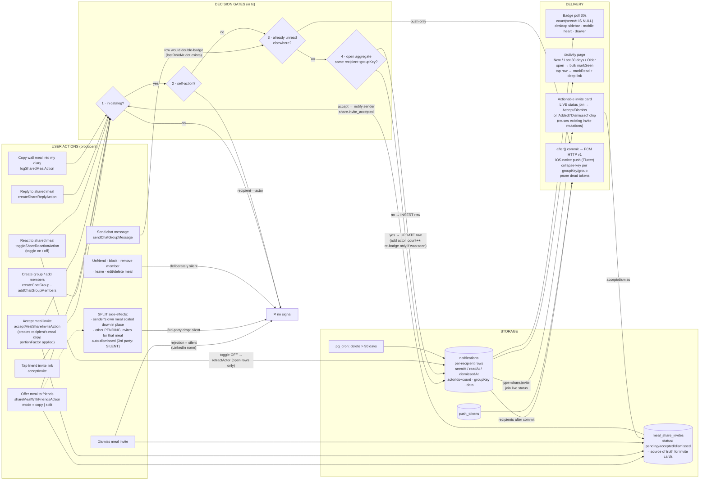
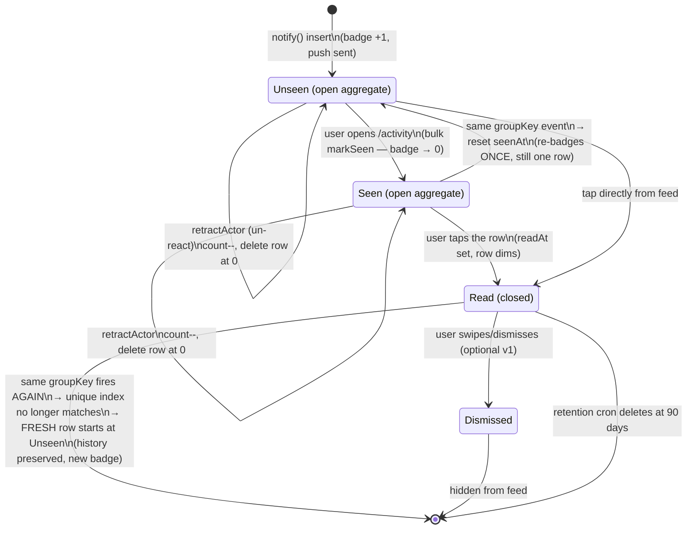

# Notifications — technical design

Status: v1 design, implemented on `claude/notification-system-design-ga76n4`.

## Context

Kallo's social layer (Circle: friends, group chats, shared meals, copy/split invites) is almost entirely **silent**: the inviter never learns someone joined via their link, group adds give no notice, reactions/replies/meal-copies produce zero signal, and meal-share invite accepts never reach the sender. The only unread machinery is two timestamp read-markers rendered as boolean dots. There is no notifications table, no push, no activity page.

Goal: a **Threads/Instagram-style Activity page** (web, mobile-responsive) backed by a properly designed notification system — informed by how Slack/Instagram design theirs — plus a server-side push pipeline so the Flutter iOS app gets native notifications.

## Decisions (user-confirmed + research-resolved)

1. **Group adds** stay instant; the added member gets a `group.added` notification deep-linking to the group (leave stays in group info). Locket model: notify, don't gate.
2. **Friend connect** stays instant-on-link; NEW `friend.joined` notification to the inviter. Research (Locket/Instagram/BeReal/Snapchat/Discord/LinkedIn/Venmo) showed: a personally shared private link counts as consent; request/approve exists to guard *discovery* surfaces (search/contact sync), which Kallo doesn't have. The schema's unused `friend_request` slot stays reserved for a future discovery path. Link expiry/revocation = separate follow-up.
3. **Entry points**: desktop sidebar "Activity" item + heart button with unread badge in the mobile header (both → `/activity`); mobile drawer row also gets the badge.
4. **Channels v1**: web = in-app only via TanStack polling (Supabase Realtime is deliberately deferred repo-wide; data plane locked by `20260825120000_lock_postgrest_data_plane.sql`). Flutter iOS = native push via FCM/APNs — this repo ships the token API + send pipeline; Flutter client work is contract-only here (separate branch later).

## Design principles (from big-tech research)

- **Slack**: ordered short-circuit decision gates; sparse preference overrides; push only when not active in-app. V1 has no prefs UI, but the dot-namespaced type taxonomy (`category.event`) lets a `notification_prefs(user_id, category, channel)` table bolt on later with zero data migration.
- **Instagram tri-state**: `seenAt` (badge = count where null; bulk-cleared on opening Activity), `readAt` (per-item on tap → dim), sections "New / Last 30 days / Older" are presentation-only.
- **Aggregation**: upsert on `(recipientId, groupKey)` partial unique index while unread — "X and 2 others reacted"; keep 3 most recent `actorIds` + true `actorCount`.
- **Actionable notifications** (the copy/split invite) reference the domain object, never own state: render live `meal_share_invites.status`; resolved elsewhere → buttons collapse to a status chip; mutations reuse the existing idempotent accept/dismiss actions.
- **Fan-out on write** (single per-recipient table): audiences are ≤10 friends / ≤50 members. 90-day retention via pg_cron.

## Holistic system diagram (end-to-end)

Every producer (including all meal copy/split paths), the decision gates, the storage, and every delivery surface in one picture:



## Notification lifecycle — FSM

Every notification row moves through this machine. The aggregation transitions (`refresh`/`retract`) are the anti-flood mechanism; the tri-state read model is the anti-starvation mechanism (nothing silently disappears — it must be seen, then read).



Key invariants encoded above:
- **One open aggregate per `(recipient, groupKey)`** — enforced by the partial unique index (`WHERE read_at IS NULL AND dismissed_at IS NULL`). 10 people reacting to your meal = **1 row, ≤2 badge events** (first reaction badges; subsequent ones update silently while unseen; only a seen→unseen reset re-badges).
- **Read rows are immutable history** — `retractActor` and refresh never touch them (Instagram behavior: un-liking doesn't rewrite the past; a new like after you've read starts a fresh row).
- **Badge = count(seenAt IS NULL)**; opening Activity zeroes it in bulk; per-row `readAt` only controls bold/dim.

## Decision pipeline — "should this event notify?" (Slack-style ordered gates)

Every producer event flows through these short-circuit gates; each gate exists to prevent a specific flood or gap:

```mermaid
flowchart TD
    E[Domain event committed in tx] --> G1{Gate 1 — Relevance\nIs the type in the v1 catalog?}
    G1 -- "no (unfriend, block, removal,\nleave, edit, dismiss)" --> X1[Silent by design]
    G1 -- yes --> G2{Gate 2 — Self-notification\nrecipient == actor?}
    G2 -- yes --> X2[Skip: never notify\nyourself]
    G2 -- no --> G3{Gate 3 — Double-badging\nDoes another surface already\ncarry this unread state?}
    G3 -- "chat.message → lastReadAt\ndot already exists" --> P[Push-only:\nNO notification row]
    G3 -- no --> G4{Gate 4 — Aggregation\nOpen row for same\nrecipient + groupKey?}
    G4 -- yes --> U[UPDATE existing row\nadd actor / bump count\nreset seenAt if seen]
    G4 -- no --> I[INSERT new row\n→ Unseen]
    U --> G5
    I --> G5{Gate 5 — Channel routing\nafter tx commit}
    P --> G5
    G5 --> C1[In-app: row is already live\nvia 30s badge poll]
    G5 --> C2{Push eligible?\ntoken registered\n+ FCM configured}
    C2 -- yes --> S[after&#40;&#41; fire-and-forget\nFCM send, collapse-key\nper groupKey / chat group]
    C2 -- no --> X3[In-app only]
```



Calibration ("not excessive, not minimal") per type:
- **High-signal, always individual**: `friend.joined`, `group.added`, `share.invite`, `share.invite_accepted` — each is a distinct human action toward you; never collapsed across objects.
- **Aggregated per object**: `share.reaction`, `share.reply`, `share.logged` — collapse to "X and N others…" per meal while open; a burst of activity on one meal is one badge, not N.
- **Suppressed entirely**: rejection signals (invite dismiss — LinkedIn norm), self-actions, anything already carried by another unread surface (`chat.message` rows), and all deliberately-silent events (Gate 1).
- Future prefs bolt onto Gate 5 as a per-category channel filter without touching Gates 1–4.

## Actionable invite sub-FSM (`share.invite` card)

The notification never owns this state — it renders `meal_share_invites.status` live (joined at list time), so acting from the Circle page, the Activity page, or another device stays consistent:

```mermaid
stateDiagram-v2
    [*] --> Pending : offer created (mode = copy | split)\ncopy → invitee gets full-portion offer\nsplit → portionFactor set AND sender's own\nmeal scaled down in place immediately
    Pending --> Accepted : accept (here or anywhere)\nguarded UPDATE WHERE status='pending'\n→ meal copy created in invitee's diary\n(portionFactor applied) → buttons collapse\nto "Added" chip → sender notified\n(share.invite_accepted)
    Pending --> DismissedI : dismiss (here or anywhere)\n→ "Dismissed" chip, sender NOT told
    Pending --> DismissedI : AUTO-dismiss — sender split the\nsame meal with someone else\n(3rd party silently dropped, no signal)
    DismissedI --> Pending : sender re-shares\n(upsert re-pends; notification refreshes\nif open, else fresh row per lifecycle FSM)
    Accepted --> Accepted : re-share is a no-op\n(never resets an accepted invite)
```



## Event catalog v1

| Type | Recipient(s) | Producer (existing fn) | Notes |
|---|---|---|---|
| `friend.joined` | inviter | `acceptInvite` — `lib/actions/groups/friendship.ts` | notify on the two edge-establishing paths; race-reconcile path stays silent |
| `group.added` | added members (not actor) | `createChatGroup` — `lib/actions/chat-groups/create-and-list.ts`; `addChatGroupMembers` — `membership.ts` | `data:{groupName}`, deep-link `/circle/g/[id]` |
| `share.invite` | invitee | `shareMealWithFriendsAction` — `lib/actions/meal-sharing/share-with-friends.ts` | **actionable** accept/dismiss inline |
| `share.invite_accepted` | sender | `acceptMealShareInviteAction` — `invite-response.ts` | dismiss stays silent (LinkedIn norm: no rejection signal) |
| `share.reaction` | meal owner | `toggleShareReactionAction` — `reactions.ts` | aggregate per share; un-react retracts from *open* aggregate only |
| `share.reply` | owner + prior repliers, minus author | `createShareReplyAction` — `replies.ts` | aggregate per share per recipient; `data:{previewBody}` |
| `share.logged` | meal owner | `logSharedMealAction` — `log-shared.ts` | aggregate per share |
| `chat.message` | group members minus sender | `sendChatGroupMessage` — `messages.ts` | **push-only, no row** (unread already exists via `chat_group_members.lastReadAt` — avoid double-badging) |

Deliberately silent: unfriend, block, member removal, leave, meal edit/delete, invite dismiss. Reserved types (pre-widened CHECK): `coach.nudge`, `streak.milestone`, `recap.ready`.

`circle_events` stays as-is (actor-scoped spine, no recipient column) — the new `notifications` table is the per-recipient layer; do not conflate them.

---

## Phase 1 — Schema + helper + producers (ships silently: rows accumulate, nothing reads them)

**Schema** (edit `lib/infra/db/schema.ts`, then `bun db:generate`; NEVER `dbr:push`/`dbr:reset` — user applies migrations):

`notifications`: id uuid PK, recipientId (FK auth.users cascade), type text, actorIds uuid[] (recent ≤3), actorCount int, objectType/objectId, targetType/targetId, groupKey text, data jsonb, createdAt/updatedAt, seenAt, readAt, dismissedAt.
Indexes: `(recipientId, createdAt DESC, id DESC) WHERE dismissed_at IS NULL` (feed cursor); `(recipientId) WHERE seen_at IS NULL AND dismissed_at IS NULL` (badge); **unique** `(recipientId, groupKey) WHERE read_at IS NULL AND dismissed_at IS NULL` (aggregation upsert target); CHECK on type list (pre-widened incl. reserved types).

**Hand-written SQL** (new files in `supabase/migrations/`, append-only, manual timestamps):
- `..._rls_notifications.sql` — `ENABLE ROW LEVEL SECURITY`, no policies (server-only access; mirrors `meal_share_replies` — grants already revoked by the lock migration).
- `..._notifications_retention.sql` — SECURITY DEFINER `reap_old_notifications()` deleting rows > 90 days, scheduled via the guarded pg_cron `DO` block copied from `20260430201543_pipeline_requests_privacy.sql`.

**Helper** — new `lib/domain/notifications/`:
- `types.ts` — `NotificationType`, `NotifyInput { recipientId, type, actorId, objectType?, objectId?, targetType?, targetId?, groupKey, data? }`.
- `notify.ts` — `notify(tx, inputs[]): Promise<string[]>` (returns recipient ids for Phase 4 push): skips self (recipient===actor), Drizzle `onConflictDoUpdate` against the partial unique index — prepend actor (dedup, cap 3), bump actorCount only for new actors, reset `seenAt`/`createdAt` so aggregates re-badge. `retractActor(tx, {recipientId, groupKey, actorId})` for un-react: decrement, delete at zero, no-op on seen/read rows (Instagram behavior).
- `group-keys.ts` — pure key builders (`'share.reaction:'+shareId`, etc.), unit-tested.

**Producer wiring** (7 files above, all inside the existing tx; carry recipient ids out of the tx closure — small mechanical refactor where actions `return db.transaction(...)` directly).

Tests: `lib/domain/notifications/__tests__/` (upsert semantics, dedup/cap, self-skip, retract paths) + per-producer recipient assertions in existing action test folders.

## Phase 2 — API + hooks

- **Contracts**: `lib/domain/notifications/contracts.ts` (isomorphic Zod — placed here, NOT `lib/api/contracts/`, which already has 10 direct files and would trip the ≤10-files structure rule): list query `{before?, limit≤50}`, markSeen `{before: datetime}`, markRead `{ids: uuid[]≤50}`, pushToken `{token, platform: ios|android|web}`. Response item: id, type, actors (hydrated `PublicIdentity[]`), actorCount, object/target refs, data, timestamps, and for `share.invite` a live-joined `invite: {status}`.
- **Actions**: `lib/actions/notifications/list.ts` (recipient-scoped, tuple cursor reusing `lib/domain/social/feed/cursor.ts` helpers, actor hydration via `lib/domain/social/identity/public-identity.ts`, left-join `meal_share_invites` for invite rows); `state.ts` (`countUnseen`, bulk `markSeen(userId, before)`, `markRead(userId, ids)` — every query carries `recipientId`: the Drizzle handle **bypasses RLS**).
- **Routes** (v1 REST so Flutter shares them, `requireUserId` + `handleRouteError` pattern): `GET /api/v1/notifications` (returns `{items, nextCursor, unseenCount}`), `GET /api/v1/notifications/badge`, `POST .../seen`, `POST .../read`.
- **Client**: `lib/domain/notifications/client.ts` (via `lib/api/client-fetch`); `lib/domain/notifications/query-keys.ts` (`notificationKeys.feed/badge`).
- **Hooks** — new `hooks/notifications/`: `use-notification-feed.ts` (`useInfiniteQuery`, staleTime 30s, per `use-friend-thread-feed.ts`), `use-notification-badge.ts` (`refetchInterval: 30_000`, exports `useUnseenNotificationCount()` mirroring `useMealShareInviteCount`), `use-notification-state.ts` (mark-seen invalidates badge; mark-read optimistic).

Tests: schema round-trips, cursor pagination, invite live-status join, recipient-scoping (foreign id untouched), route 401/400.

## Phase 3 — Activity UI + nav + badges

**Page**: `app/[locale]/(app)/activity/page.tsx` (server shell) → `components/activity/` (all ≤200 LOC):
- `activity-page.tsx` — orchestrator; v1 has **no tabs** (volume is tiny; invite cards sit inline like Instagram's follow-request row; `view-switcher.tsx` pill tabs bolt on later). Mark-seen effect: after first page load, if unseen>0 → `postMarkSeen(maxCreatedAt)` → invalidate badge.
- `activity-sections.tsx` — New / Last 30 days / Older buckets, presentation-only; "New" = `seenAt` null **in a client-held snapshot** (a ref of the ids that were unseen the first time they rendered — `useMarkNotificationsSeen` invalidates the FEED as well as the badge, so a live re-read of `seenAt` would empty the section a round trip after it painted) (so rows don't jump sections mid-visit); infinite scroll via the `thread-feed.tsx` IntersectionObserver idiom (don't reuse ThreadFeed itself — wrong strings/separators).
- `notification-row.tsx` — `ProfileAvatar` stack (≤2), message from i18n templates per type with `{name}/{count}` interpolation, `formatElapsed` timestamp, unseen dot, whole row = `Link` (i18n navigation, never next/link): `friend.joined|share.*` → `/circle`, `group.added` → `/circle/g/[id]`; tap fires mark-read fire-and-forget.
- `share-invite-row.tsx` — actionable card: `invite.status==='pending'` → Accept/Dismiss reusing `useAcceptMealShareInvite`/`useDismissMealShareInvite` (styling from `meal-invites.tsx`), success also invalidates `notificationKeys`; otherwise status chip.
- Empty state via `components/ui/empty-state.tsx` (Heart icon).

**Nav** (verified against code):
- `nav-items.ts`: add `{ id: 'activity', href: '/activity', labelKey: 'activity', icon: Heart }` — **not** Lucide `Activity` (taken by nutrition, nav-items.ts:29).
- `desktop-sidebar.tsx` / `mobile-nav-list.tsx` / `mobile-nav.tsx`: all three read `useNavBadgeCounts()` (`hooks/ui/use-nav-badges.ts`), a `Record<navItemId, count>` of the pending-invite and unseen-notification counts, so the rail, the drawer row and the header heart can never disagree about which destination carries unread state.
- **Mobile heart**: new `components/activity/mobile-activity-button.tsx` rendered in `mobile-nav.tsx` **replacing the aria-hidden size-11 spacer div (lines 200–203)** — NOT portaled into `#app-mobile-header-slot` (that slot is a single-filler contract owned by MobileTimelinePicker with a strip-mode protocol; verified in code comments at mobile-nav.tsx:187-199). A size-11 heart button preserves the slot's centering exactly and appears on every screen; hide in strip mode with the spacer's existing `group-has-[[data-strip-mode=true]]/mobileheader:hidden` class.

**i18n**: register `'activity'` in the `namespaces` array in `i18n/config.ts` (silent failure otherwise); add `messages/en/activity.json` + `messages/vi/activity.json` (row templates incl. aggregate plurals, sections, empty state, buttons) and the sidebar label in both `app.json` files + metadata title.

Tests: section bucketing, template selection per type, invite card state machine, mark-read on tap, nav badge plumbing. Manual: two-account flow (react/unreact badge, reply aggregation, invite accept from Activity, group-add deep link, friend join, badge clears on visit, vi locale).

## Phase 4 — Push pipeline + token API

Status: implemented.

**Delivery decision**: fire-and-forget via Next 16 `after()` scheduled **after tx commit** (recipient ids returned by `notify()`), behind a mockable `lib/infra/push` boundary. No queue table — in-app row is the durable record; lost push on process death is acceptable at this scale. Works self-hosted (repo ships a Dockerfile).

- `lib/infra/push/types.ts` — `PushMessage {token, title, body, data, collapseKey?, badge?}`, `PushSendResult {token, ok, shouldPrune}`, `PushSender`.
- `lib/infra/push/fcm.ts` — FCM HTTP v1 **without new deps**: service-account JWT via `node:crypto` RSA-SHA256 → oauth2 token (module-level cache, 55 min) → `messages:send`, ten per `Promise.allSettled` wave; env `FCM_SERVICE_ACCOUNT_JSON` (whole service-account JSON in one var, documented in `.env.example`). The `apns`/`android` blocks are built conditionally — FCM 400s on unknown or null fields. Prune classification: HTTP 404 or `UNREGISTERED`, and 400 `INVALID_ARGUMENT`; 401/403/429/5xx keep the row. (`firebase-admin` is the drop-in alternative behind the same interface if preferred later.)
- `lib/infra/push/sender.ts` — `getPushSender()`: the FCM sender when `FCM_SERVICE_ACCOUNT_JSON` is set, otherwise a no-op sender, so dev/CI/tests never need Firebase config. (No separate `noop.ts`; the no-op is three lines beside the resolver.)
- `lib/domain/notifications/push-copy.ts` — server-side en/vi push templates (`pushCopy(type, locale, values)`), same voice as `messages/*/activity.json` rows but a separate consumer: the device has no next-intl bundle. A push always uses the SINGULAR sentence — the aggregate count lives on the in-app row. `title` is `Kallo` for activity events and the SENDER's name for `chat.message`.
- `lib/domain/notifications/push.ts` — `sendNotificationPush(recipientIds, payload, sender?)`: load tokens (one `IN` query), load `user_profiles.preferredLocale` per recipient, resolve the actor's display name from `public_profiles` when the producer did not already hold it, build one message per device, send, delete every token whose result says `shouldPrune`. **Never throws** — every path is caught and `console.error`'d, because it runs in `after()` on a request that already succeeded. `sendChatMessagePush({groupId, senderId, senderName?, preview})` fans out to group members minus the sender with collapse key `chat:<groupId>` and a ≤140-char preview.
- `push_tokens` table (Drizzle `20260828131955_add_push_tokens`, + `..._rls_push_tokens.sql` enabling RLS with no policies): userId, token (unique — POST reassigns the owner, since the OS hands one token to whoever signs in next), platform CHECK, lastSeenAt, createdAt, index on userId. Idle reap lives in its own append-only migration `..._push_tokens_retention.sql` (`reap_stale_push_tokens()`, >270 days, same guarded pg_cron `DO` block) — the Phase 1 retention migration is not edited.
- `app/api/v1/notifications/push-tokens/route.ts` — POST upsert (`onConflictDoUpdate` on the token, reassigning userId/platform and refreshing lastSeenAt) / DELETE (scoped `userId AND token`). Both documented in `lib/api/openapi/paths/notifications.ts`.
- `after(() => sendNotificationPush(...))` is wired at the 7 producer call sites, plus `after(() => sendChatMessagePush(...))` in `lib/actions/chat-groups/messages.ts` (no notification row). Every producer is reached from a route handler, so plain `after()` is always in request scope; producers that returned `db.transaction(...)` directly now assign to a local first and drain the captured recipient ids afterwards.

Tests: `lib/infra/push/__tests__/fcm.test.ts` (JWT assembly, token cache reuse, conditional apns/android blocks, prune classification), `lib/domain/notifications/__tests__/push.test.ts` (token load, per-recipient locale, data payload, prune, never-throws, chat fan-out and truncation), `app/api/v1/notifications/push-tokens/__tests__/route.test.ts` (upsert reassignment, delete scoping, 400/401), and a scheduled-push assertion added to each producer suite.

## Phase 5 — Flutter (contract only; separate branch)

**Token lifecycle**: `POST /api/v1/notifications/push-tokens` with `{token, platform: 'ios'|'android'|'web'}` on login and on every FCM token refresh (idempotent, reassigns the token to the caller); `DELETE` the same path with `{token}` on logout. Bearer auth, same as every other `/api/v1/*` route.

**Payload contract** — title and body arrive **pre-localized** in the recipient's `preferred_locale`; the `data` map is flat strings:

```jsonc
{
  "notification": { "title": "Kallo", "body": "Mai added you to Trip" },
  "data": {
    "type": "group.added",          // always present
    "targetType": "chat_group",     // present when the tap has a destination
    "targetId": "<uuid>",           // present with targetType
    "notificationId": "<uuid>"      // RESERVED — not emitted by v1 producers
  }
}
```

`type` is one of the catalog types plus `chat.message`. `targetType`/`targetId` are emitted today only by `group.added` and `chat.message` (`chat_group` + the group id); the share/friend events carry neither, so their tap falls through to the default destination. `notificationId` is part of the contract and the sender supports it, but no v1 producer populates it (`notify()` returns recipient ids, not row ids) — the client must treat it as optional and must not key behaviour on its presence.

**Collapse keys**: the notification's `groupKey` (`share.reaction:<shareId>`, `group.added:<groupId>`, …) for activity events, `chat:<groupId>` for messages — sent as `apns-collapse-id` and Android `collapse_key`, so a burst on one object supersedes itself rather than stacking.

**Deep-link map**: `group.added` and `chat.message` → the group screen (`targetId`), everything else → circle. The Activity tab later consumes the same `/api/v1/notifications*` endpoints. APNs badge = unseen count at send time is supported by `PushMessage.badge` but not yet populated (nice-to-have). Flutter nav parity for the new entry is part of this phase.

---

## Verification (every phase)

1. `bun test` — new suites + untouched suites green.
2. `bunx @biomejs/biome check .`
3. `bun check:structure` — watch `components/activity/` and `hooks/notifications/` counts; contracts placed in `lib/domain/notifications/` to avoid the known `lib/api/contracts/` 10-file ceiling.
4. `bun db:generate` produces only intended DDL; migration application is handed to the user.
5. Manual two-account flows (Phase 3 list); Phase 4: send a real FCM message to a sandbox token via a scratch script before wiring producers.

## Known risks

- `share.invite` re-offer after the old notification was read creates a fresh row — correct; the live join keys on `objectId` (inviteId, stable per meal+recipient).
- Producers returning `db.transaction(...)` directly need a small refactor to carry recipient ids out for `after()` — mechanical, 7 files.
- Cursor helper (`decodeSharedMealCursor`) carries a feed-specific error message — wrap or accept (cosmetic).
- Flutter has no FCM dependency today; iOS push also needs APNs key/Firebase project setup (user-side infra, outside the repo).
